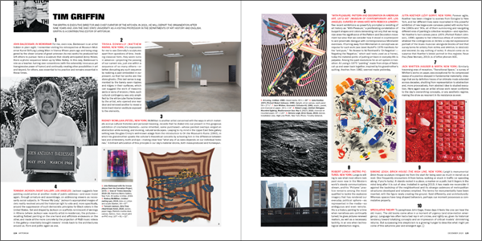
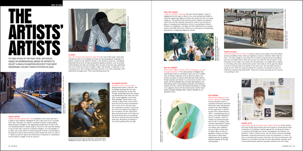
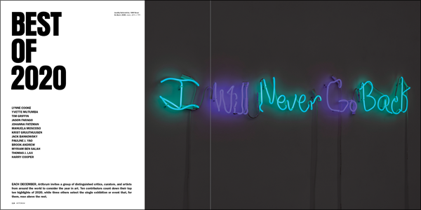
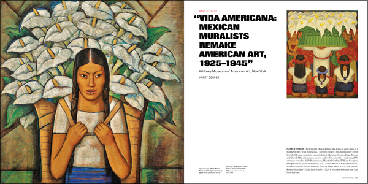
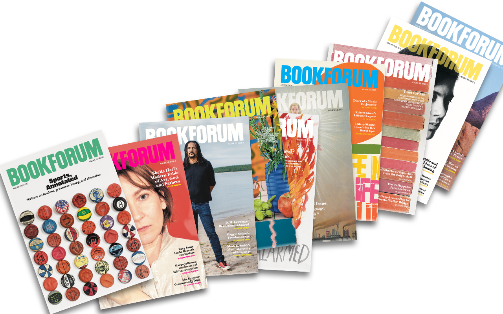
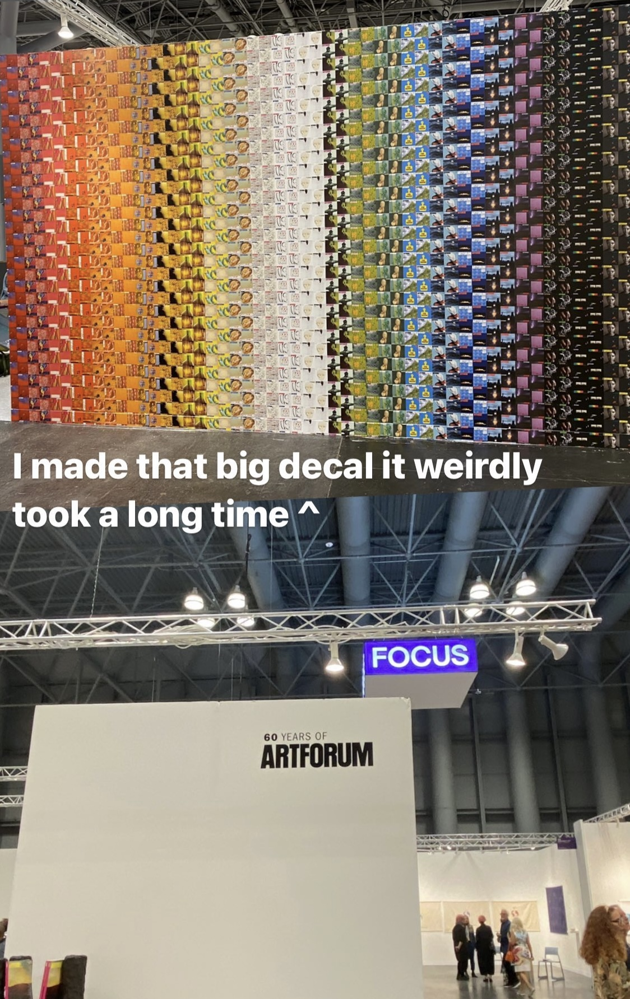
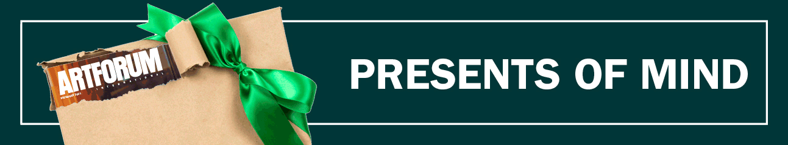
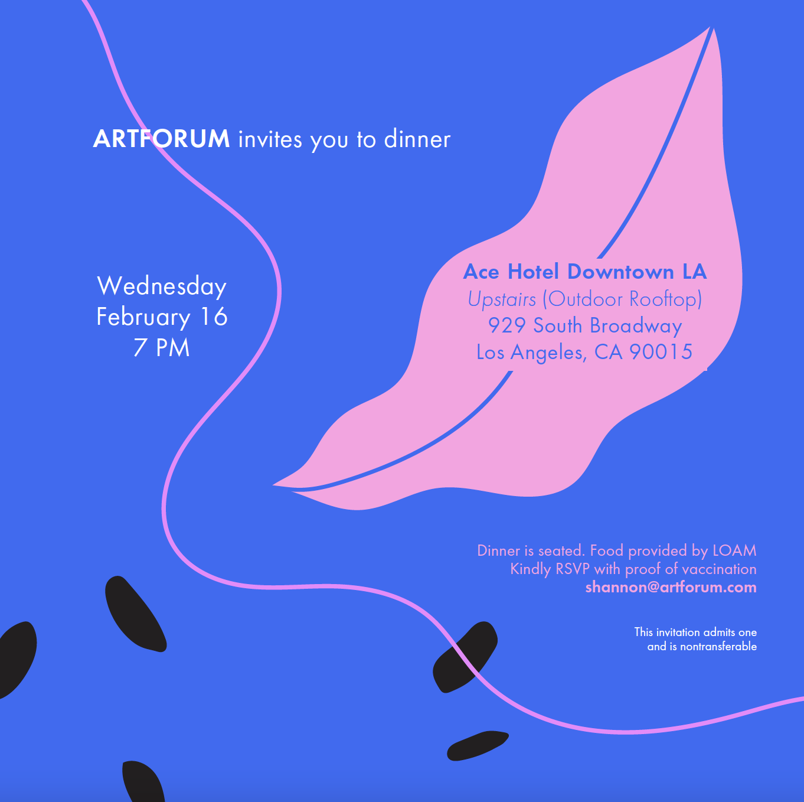
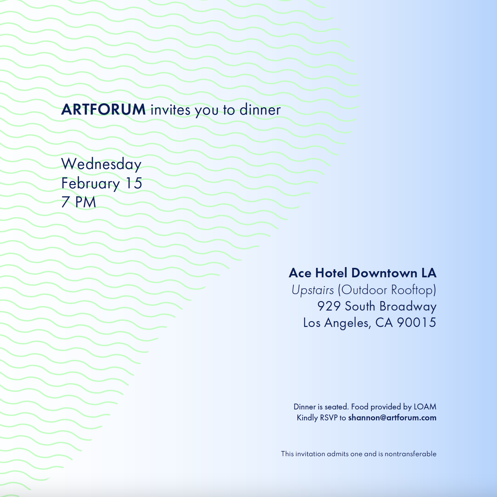
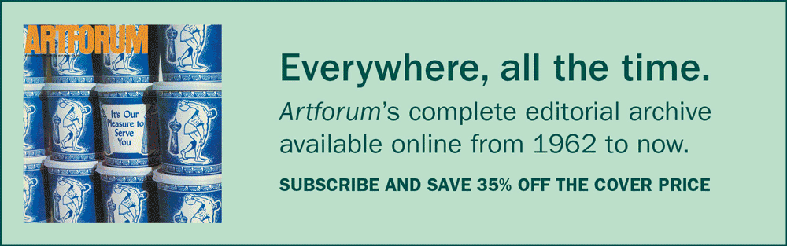

# Artforum Magazine

In my time at Artforum Magazine I have worn many hats. As Production Associate, I was tasked with creating an identity for Artforum in its promotional distribution. Here are a few of the templates I created for the magazine.

## Gallery

*Artforum Banner*

*Promotional Banner*

*Artforum Banner*

*Magazine Spread*

*Magazine Spread*

*Magazine Spread*

*Magazine Spread*

*Magazine Stack*

*Showcase Decal*

*Bookforum Banner*

*Bookforum Banner*

*Promotional Banner*

*Event Invitation*

*Event Invitation*

*Banner*

