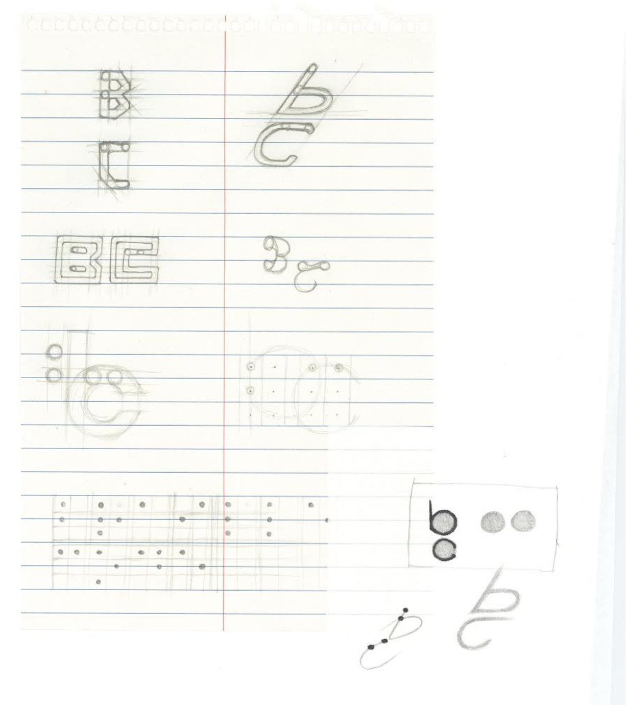
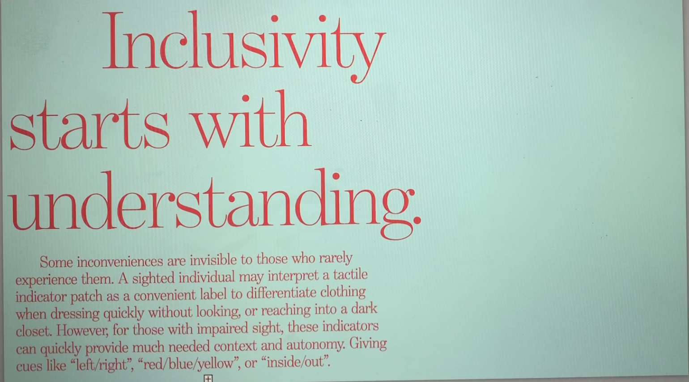
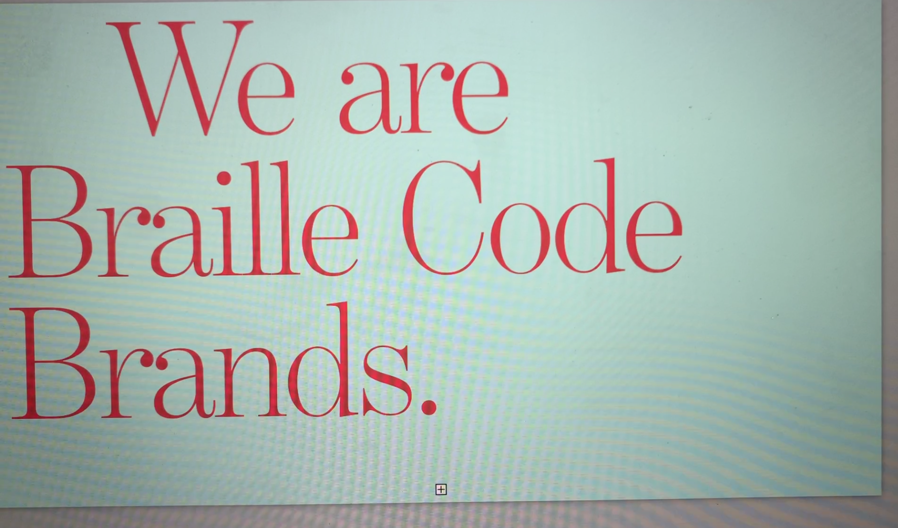
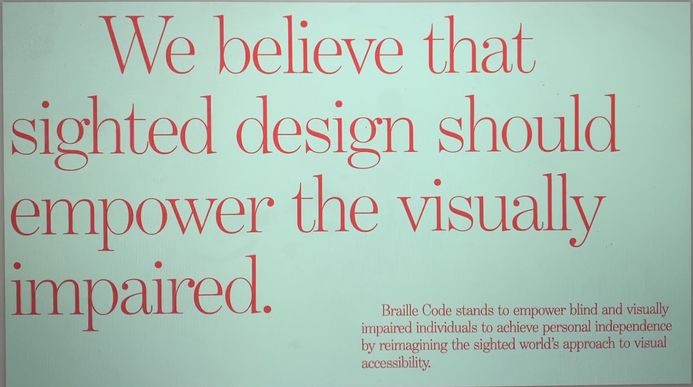
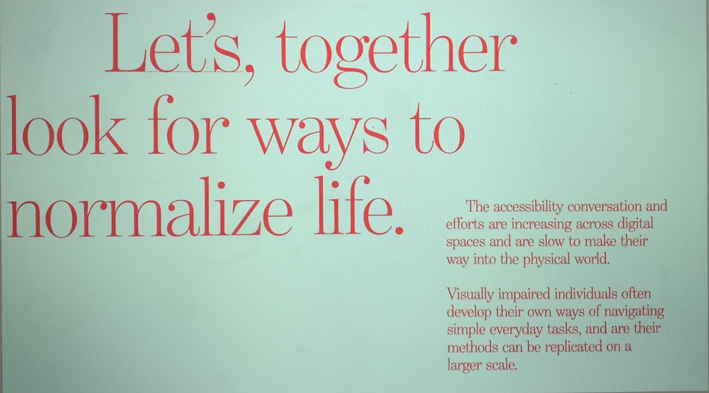
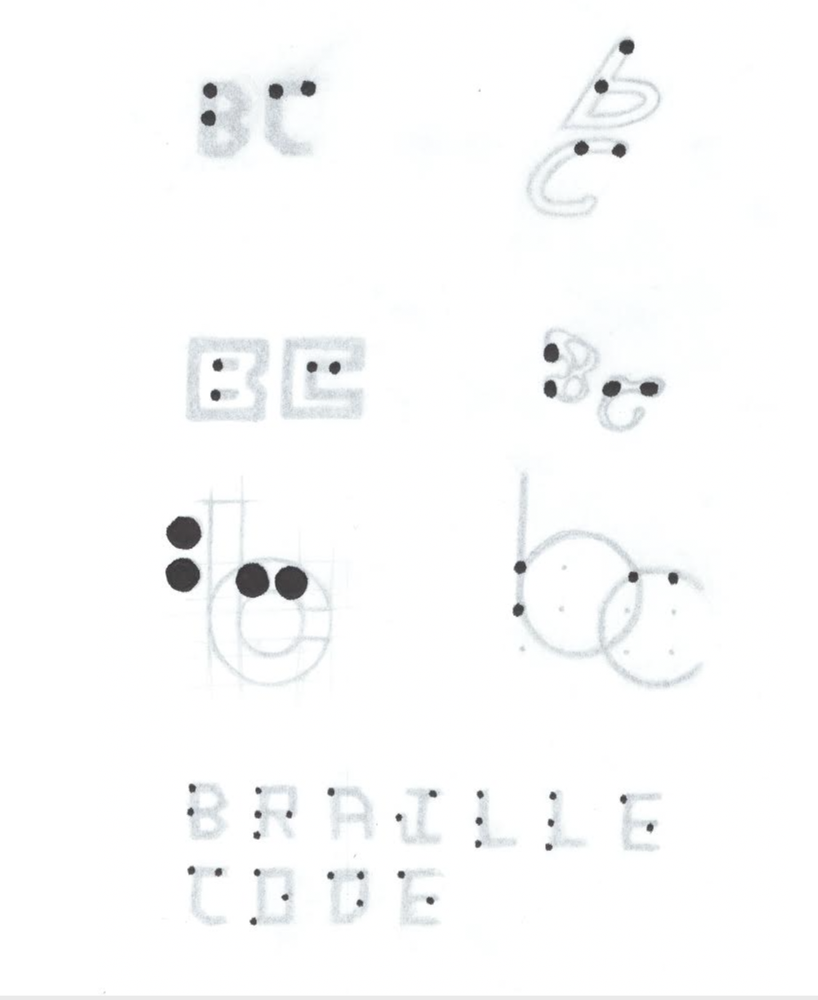
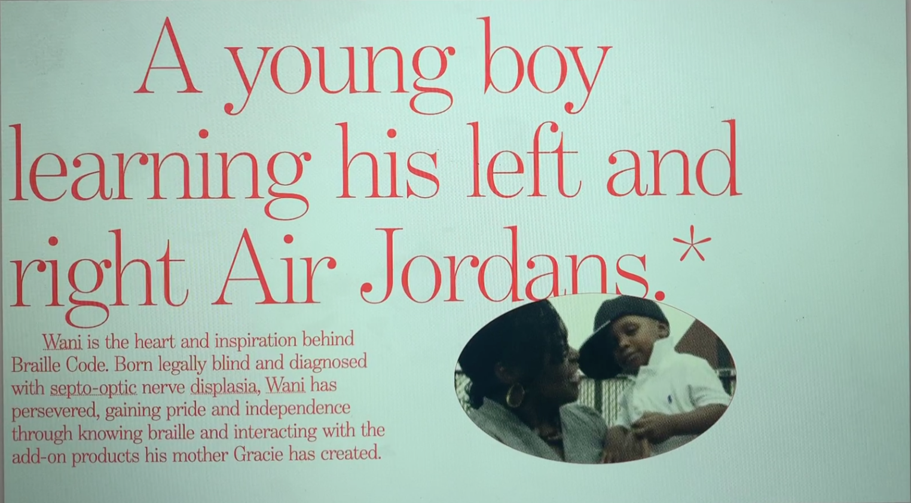

# Braille Code

In a partnership with Nike, I was tasked with creating a brand identity that would be aesthetically accessible to the blind. This was a rather epistemologically fascinating exercise which caused me to reckon just how simple it would be to make the world more accessible. The initiative was intended to create tactile clothing tags and embroidery for the visually impaired to be able to distinguish clothing easily by way of symbols. Color, left and right, levels of warmth. The project is still in production, but here were some of our ideations and research regarding logo designs for this company.

## Gallery

*Description*
*Date*

*Description*
*Date*

*Description*
*Date*

*Description*
*Date*

*Description*
*Date*

*Description*
*Date*

*Description*
*Date*

