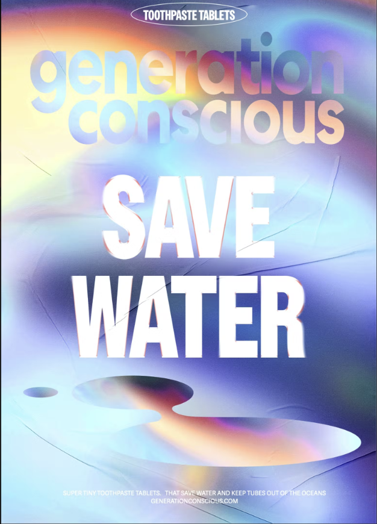
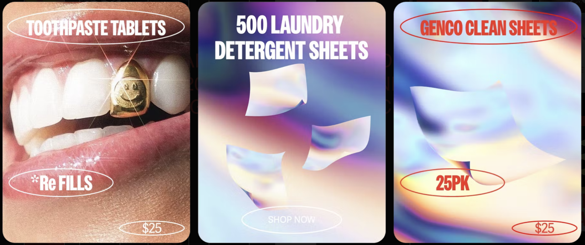
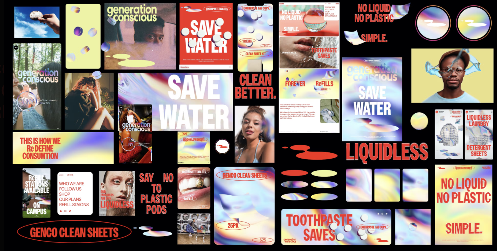

# Generation Conscious

Generation Conscious was an initiative to reduce water waste in toiletry and laundry products. A subsidized program to make environmentally sustainable products available for free to thousands of college campuses across America.

 
 

## Gallery

*Concept*
*Date*

