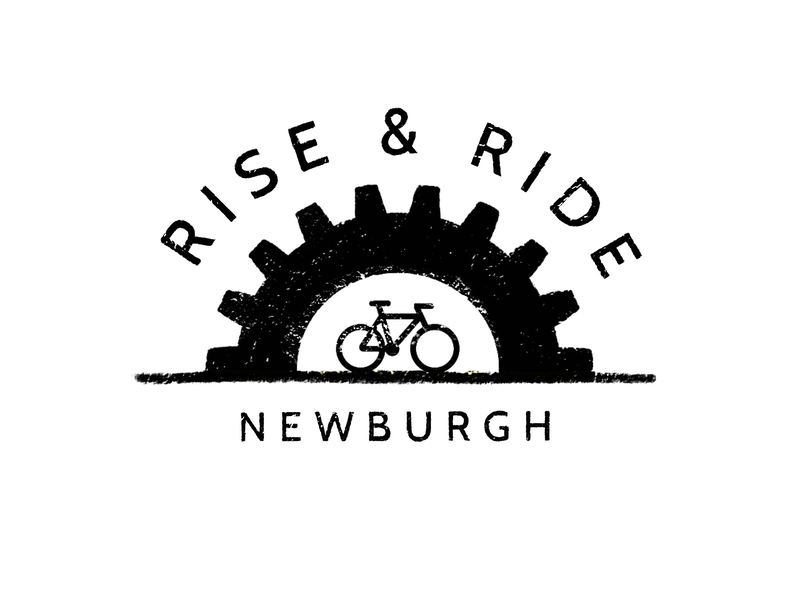
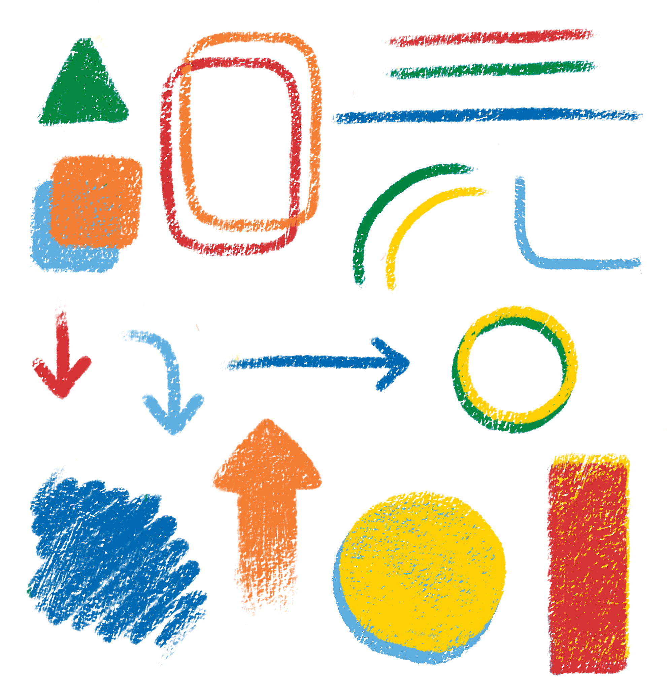
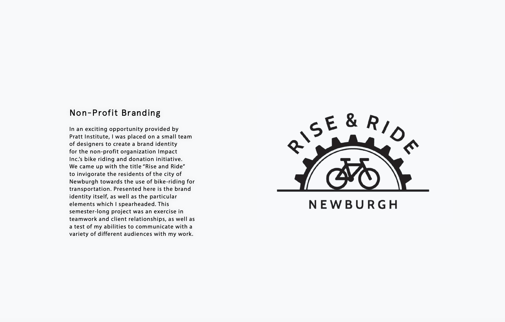
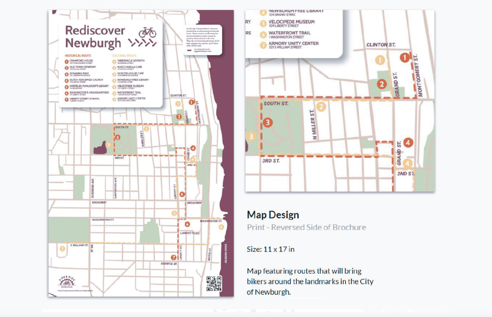
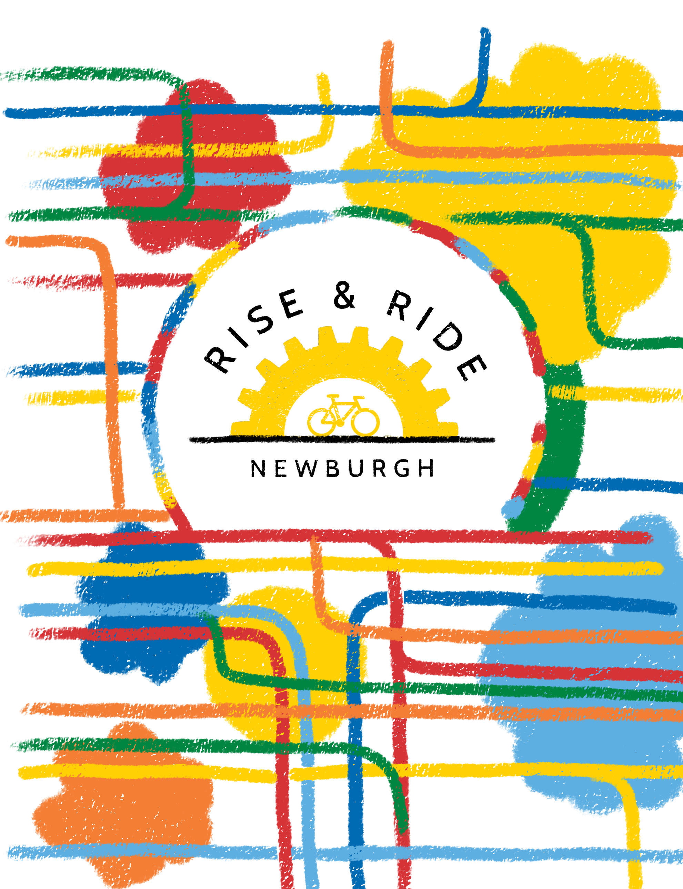
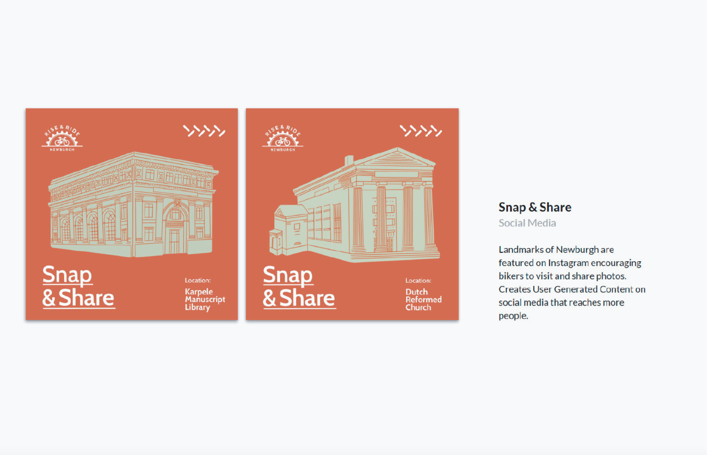
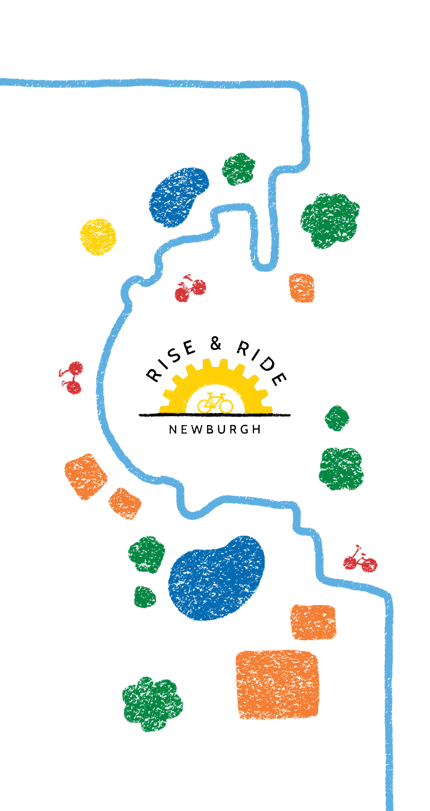
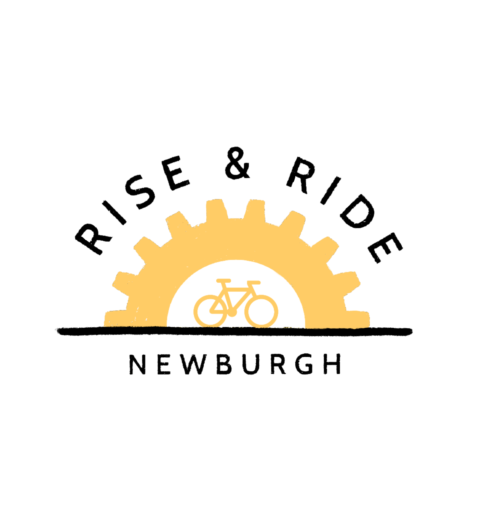
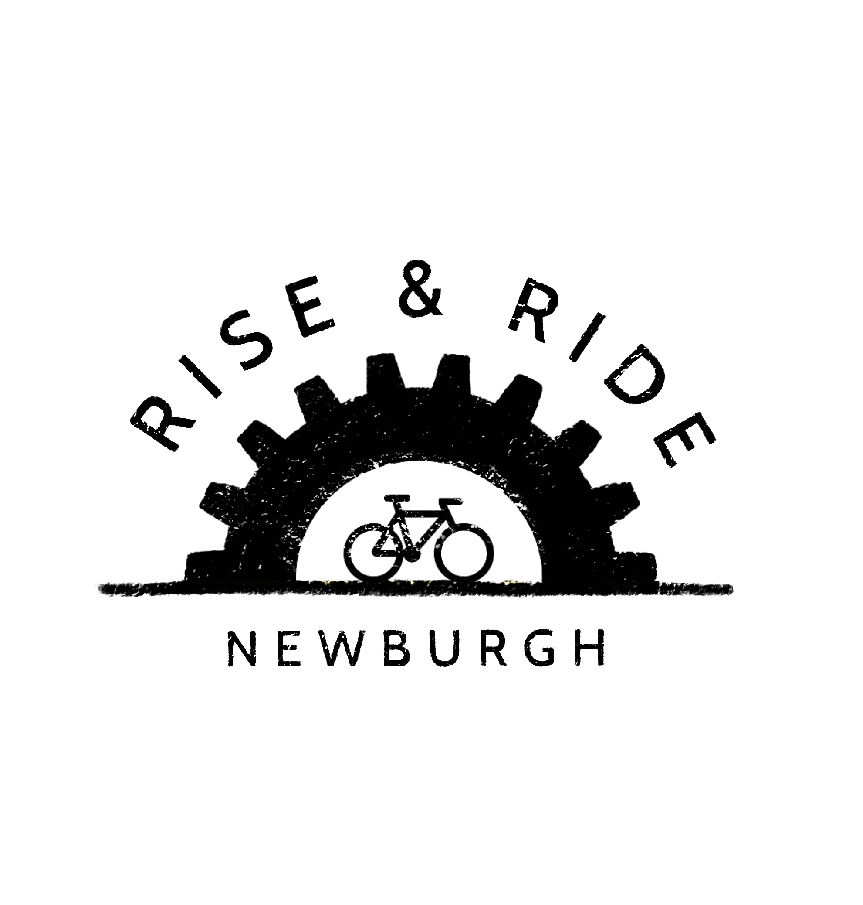
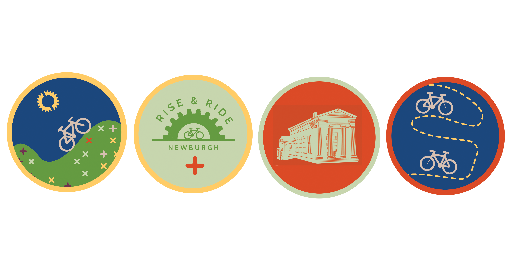

# Rise & Ride

In an exciting opportunity provided by Pratt Institute, I was placed on a small team of designers to create a brand identity for the non-profit organization Impact Inc.’s bike riding and donation initiative. We came up with the title “Rise and Ride” to invigorate the residents of the city of Newburgh towards the use of bike-riding for transportation. Presented here is the brand identity itself, as well as the particular elements which I spearheaded. This semester-long project was an exercise in teamwork and client relationships, as well as a test of my abilities to communicate with a variety of different audiences with my work.

## Gallery

*Description*
*Date*

*Description*
*Date*

*Description*
*Date*

*Description*
*Date*

*Description*
*Date*

*Description*
*Date*

*Description*
*Date*

*Description*
*Date*

*Description*
*Date*

*Description*
*Date*

*Description*
*Date*

*Description*
*Date*

*Description*
*Date*

*Description*
*Date*

