# videography

- [A Brief History of Propaganda Posters](https://link-url-here.org) 
- [NYC Skyline](https://link-url-here.org) 
- [John Lennon & Yoko Ono's Interview With Hustler](https://link-url-here.org) 
- [Illustrating The Lord of The Rings](https://link-url-here.org)
   
- [Bodmer's Travels](https://link-url-here.org)
   
- [Printed Matter](https://link-url-here.org)
   
- [Environmental Photographers](https://link-url-here.org)
   
- [Edward Gorey's Doubtful Guest](https://link-url-here.org)
   
- [Vintage Site Survey Photos](https://link-url-here.org)
   
- [Andy Warhol's Color Screenprints](https://link-url-here.org)
   
- [What Is a Color Woodcut](https://link-url-here.org)
   
- [Art Deco Posters](https://link-url-here.org)
   
- [A Book That Saved Horses](https://link-url-here.org)
   
- [The Subculture Sale](https://link-url-here.org)

## Gallery

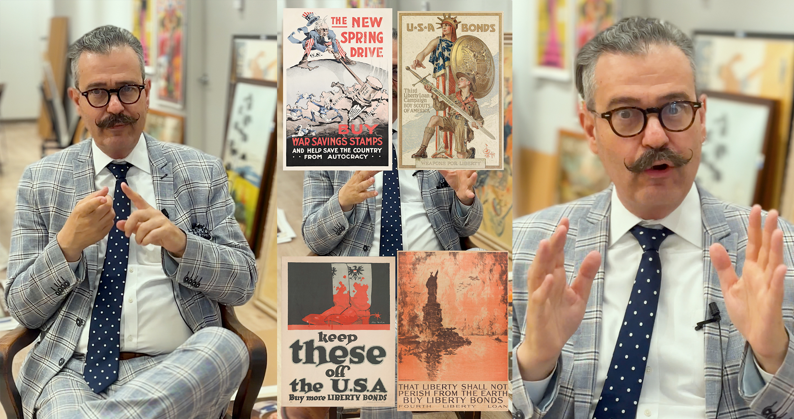
*A Brief History of Propaganda Posters*

*NYC Skyline*

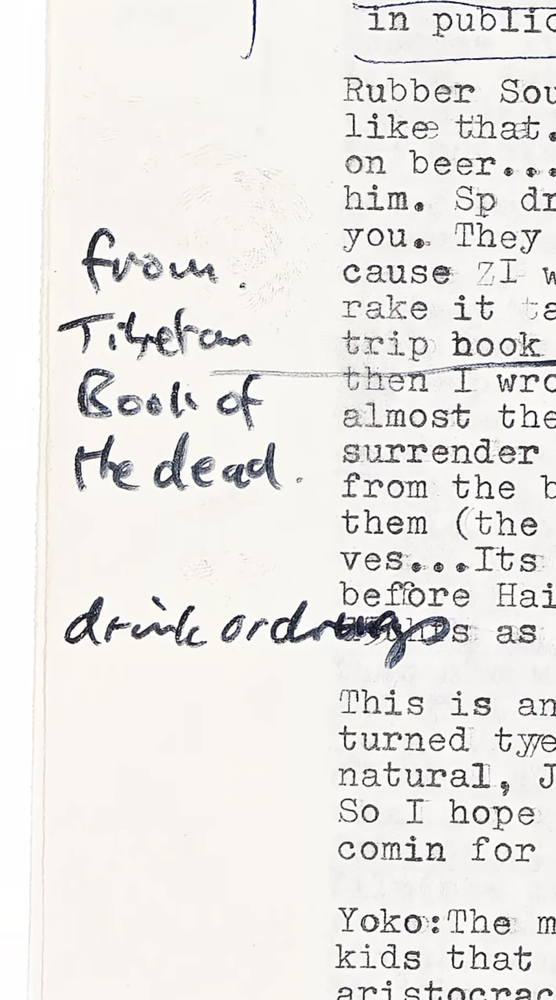
*John Lennon & Yoko Ono's Interview With Hustler*

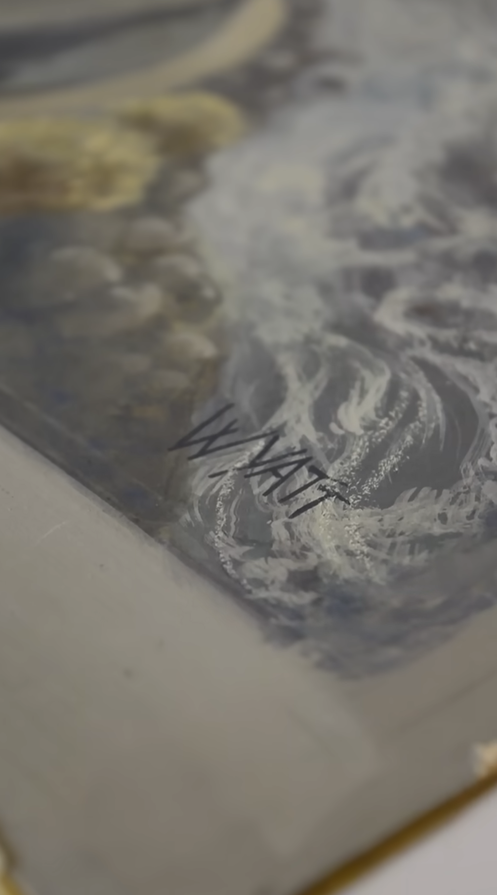
*Illustrating The Lord of The Rings*

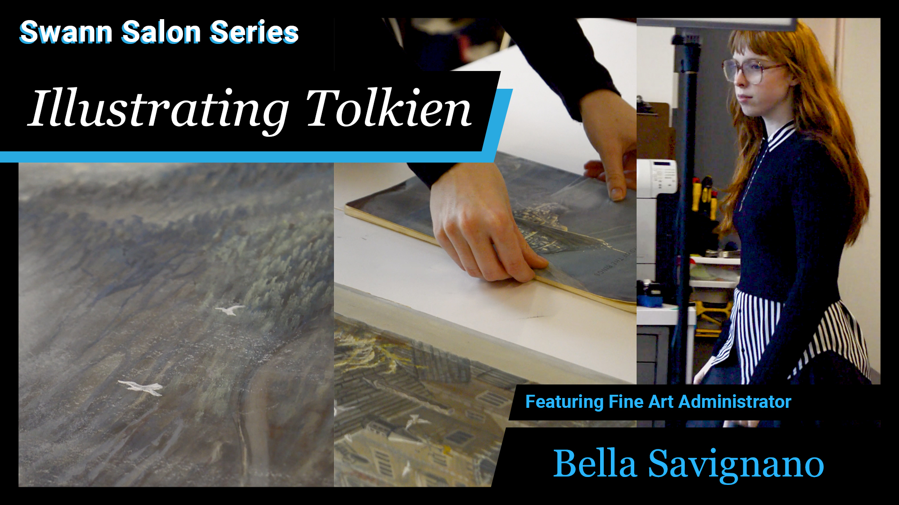
*Illustrating The Lord of The Rings*

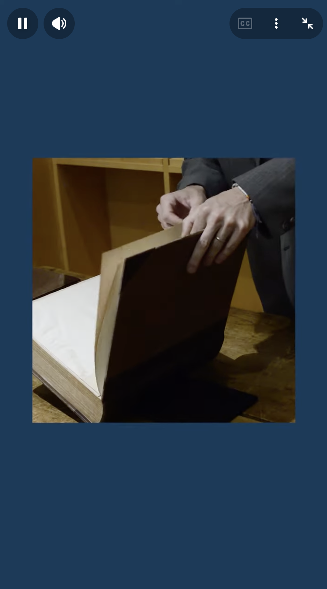
*Bodmer's TravelsPrinted Matter*

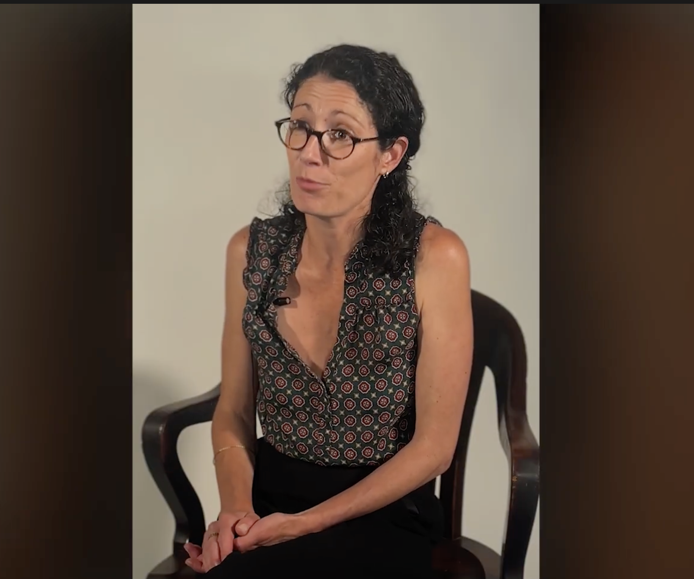
*Environmental Photographers*

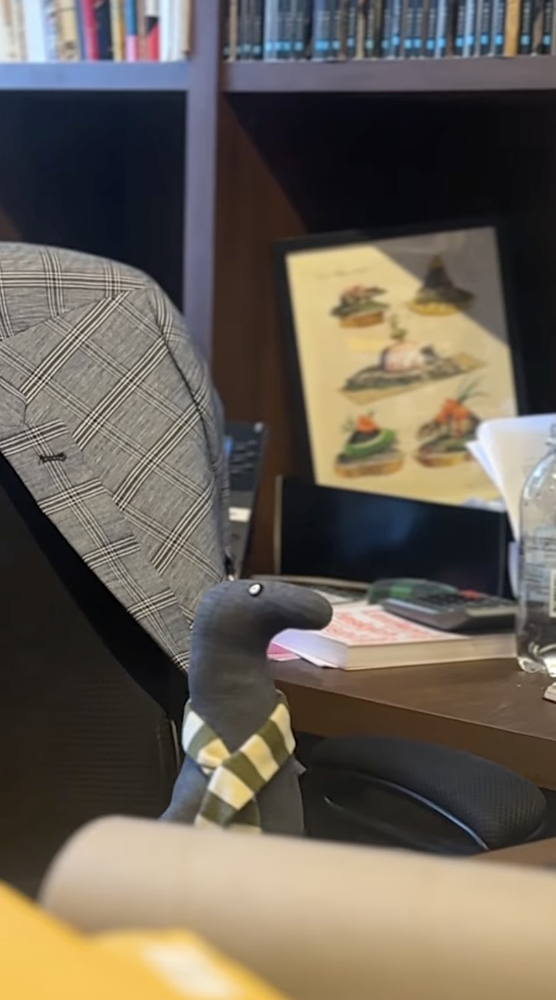
*Edward Gorey's Doubtful Guest*

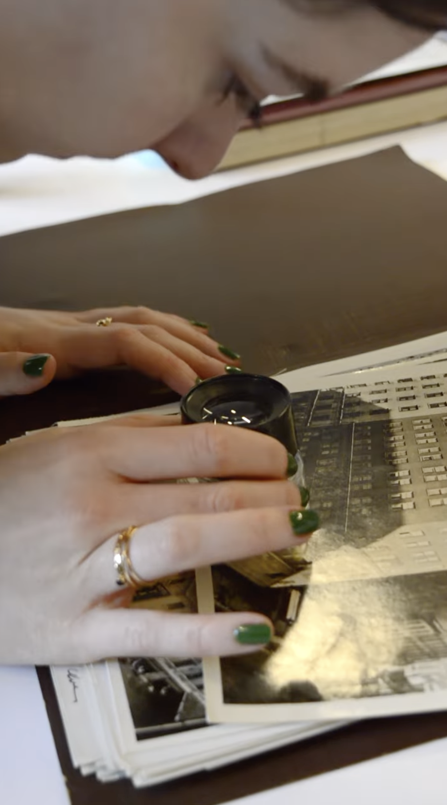
*Vintage Site Survey Photos*

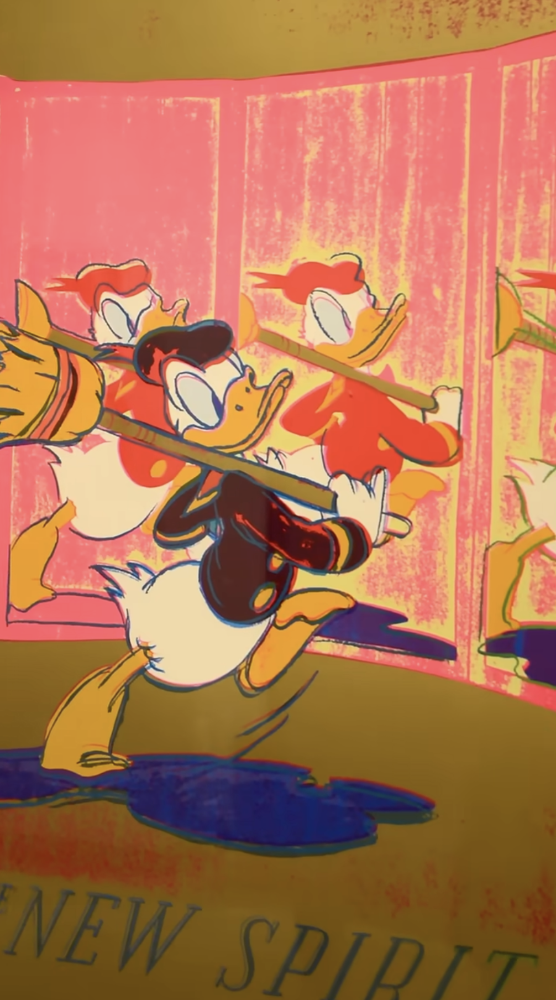
*Andy Warhol's Color Screenprints*

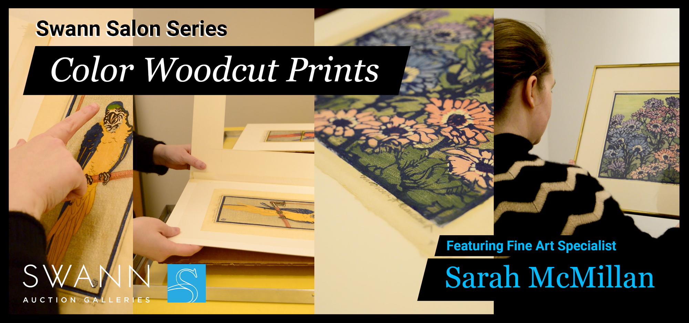
*What Is a Color Woodcut*

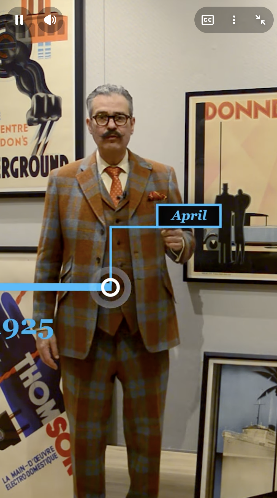
*Art Deco Posters*

*A Book That Saved Horses*

*The Subculture Sale*

