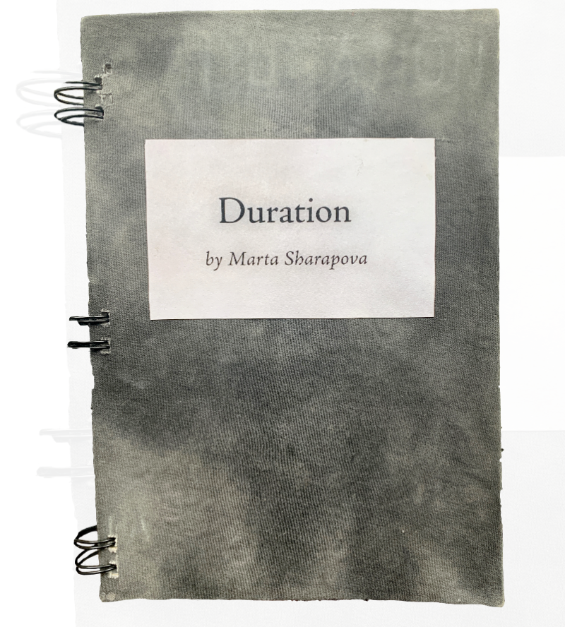
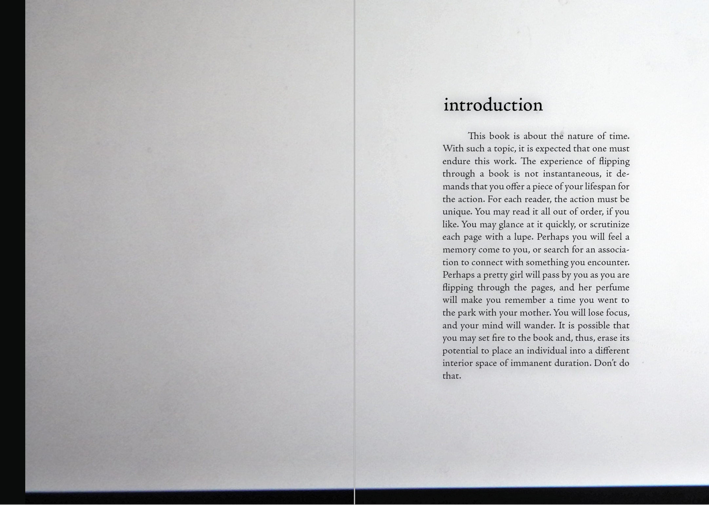
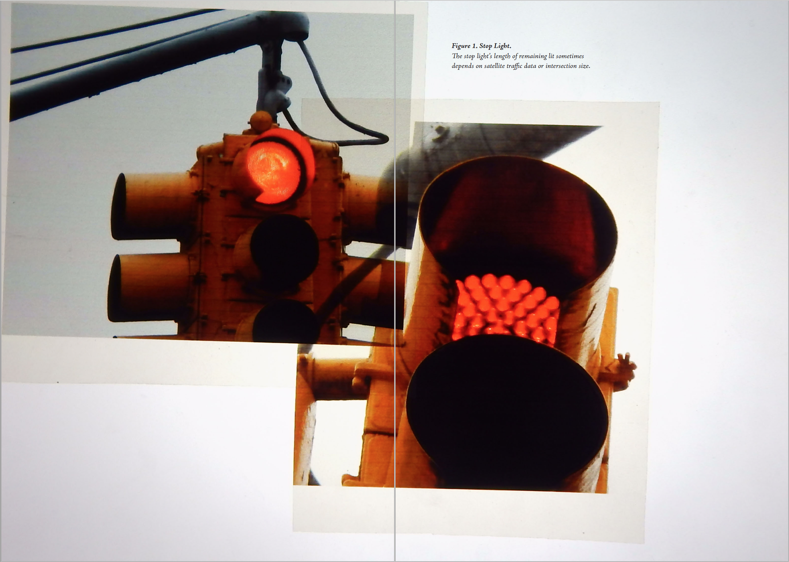
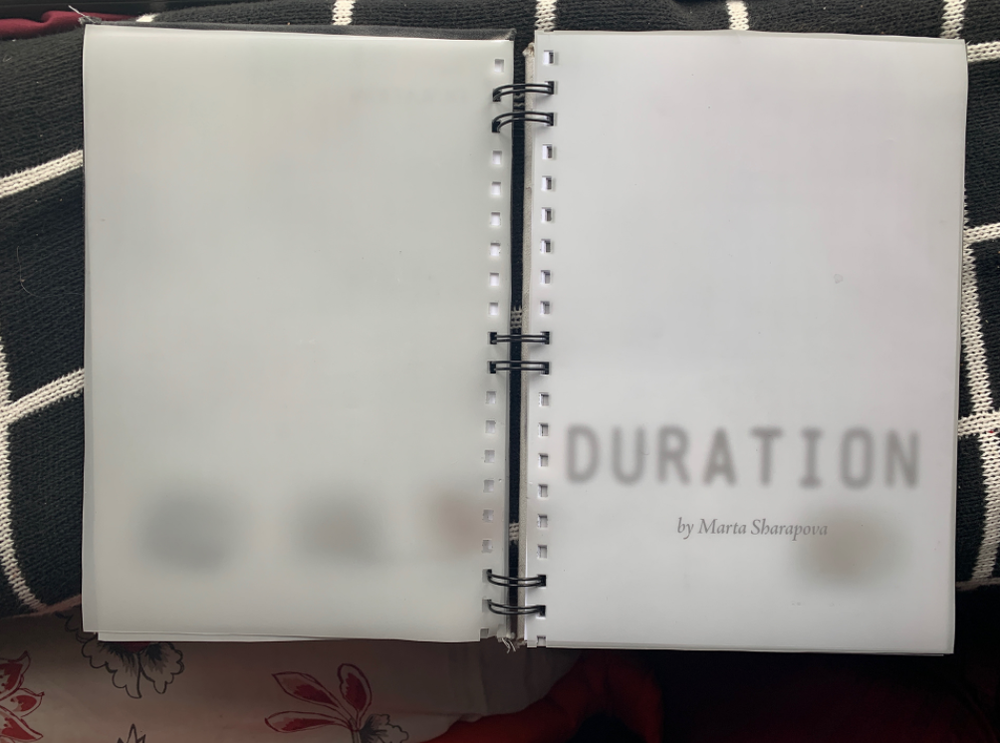
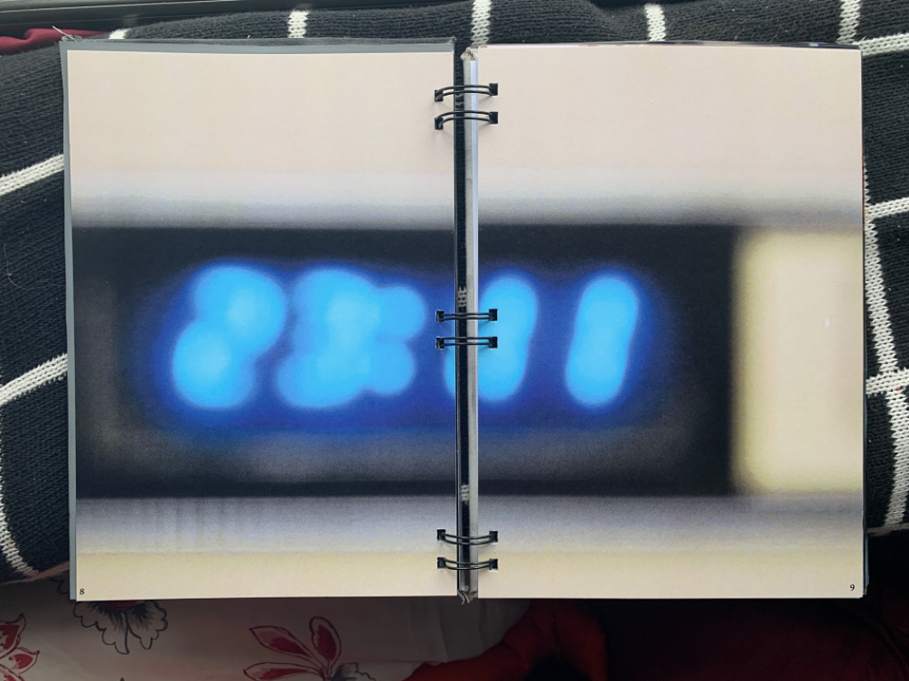
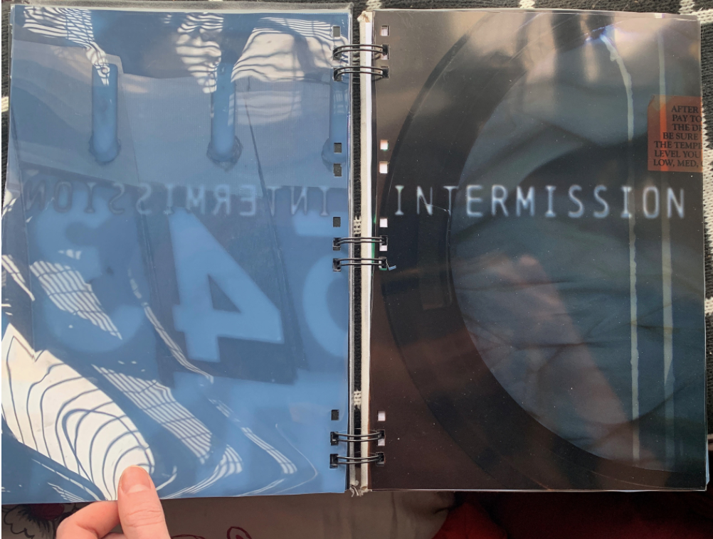

# Duration

This was an experimental design project to play with the durational experience of flipping through a book. It featured four chapters, separated by an intermission, including a photo essay about time, an interview with a professor of Deleuze, an original essay on Henri Bergson, and a final taxonomy of objects and scenes that hold time.

## Gallery

