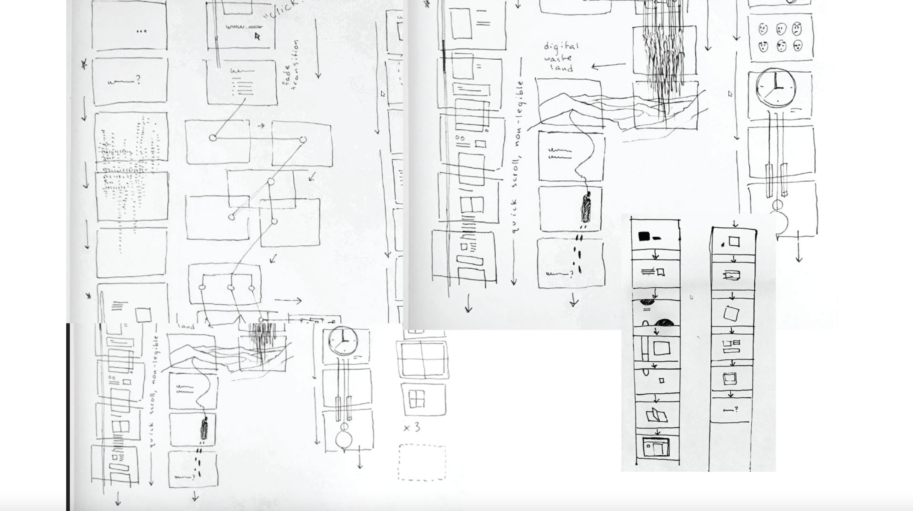
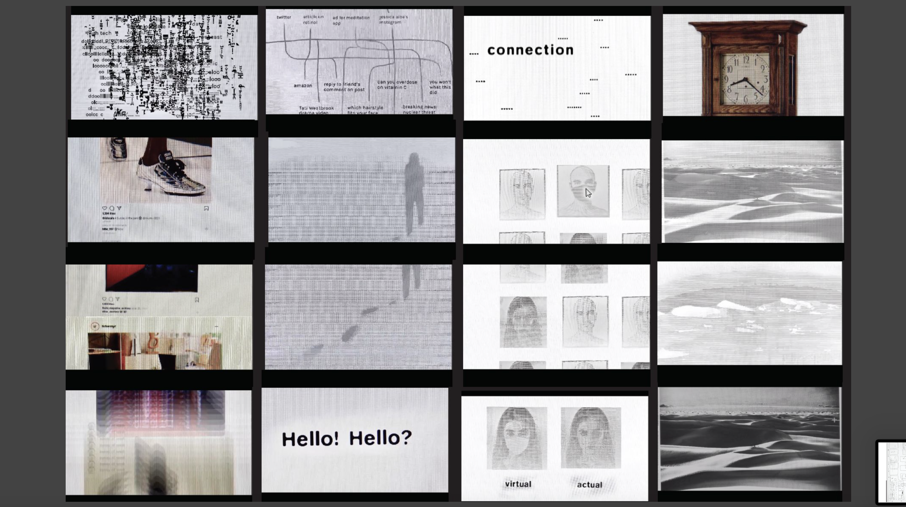
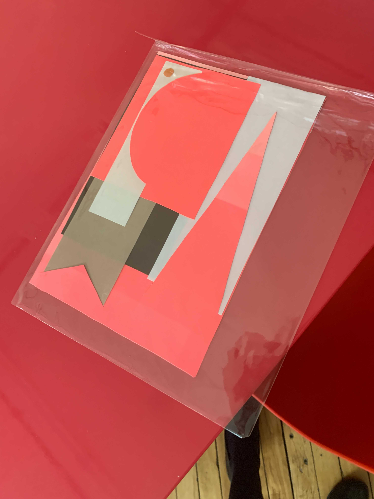
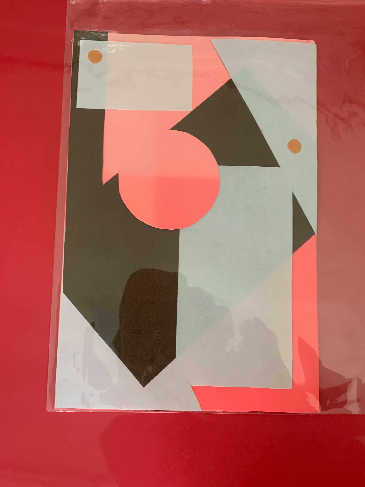
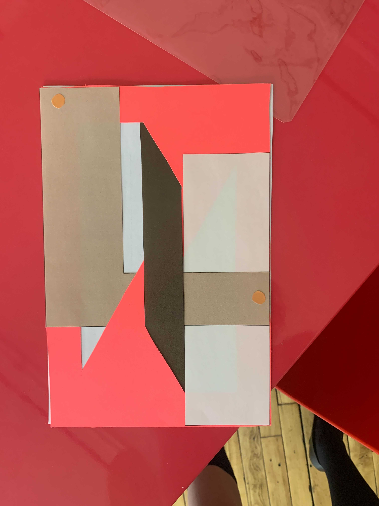
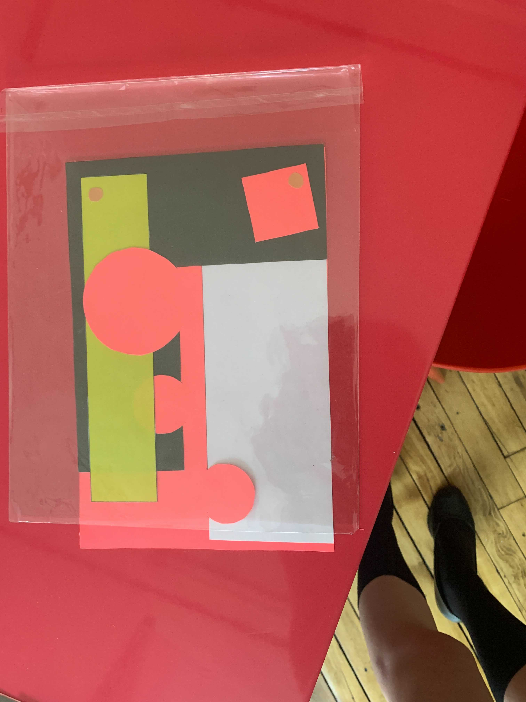

# Experimental Work

Here are a few of my more lofty explorations, including my attempt at creating a translator via photo-recognition technology by analyzing cuttlefish’s visual language on the surface of the skin.

## Gallery

