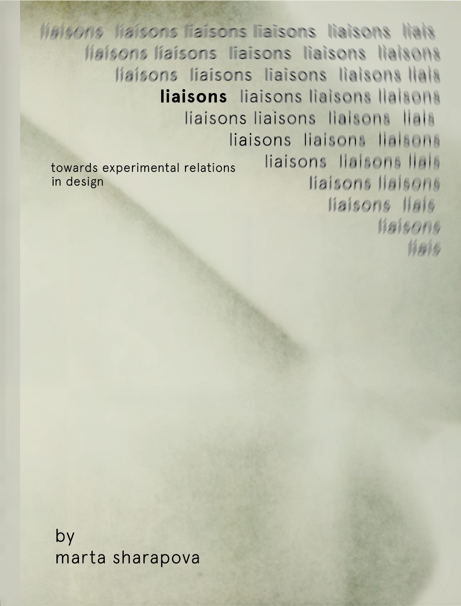
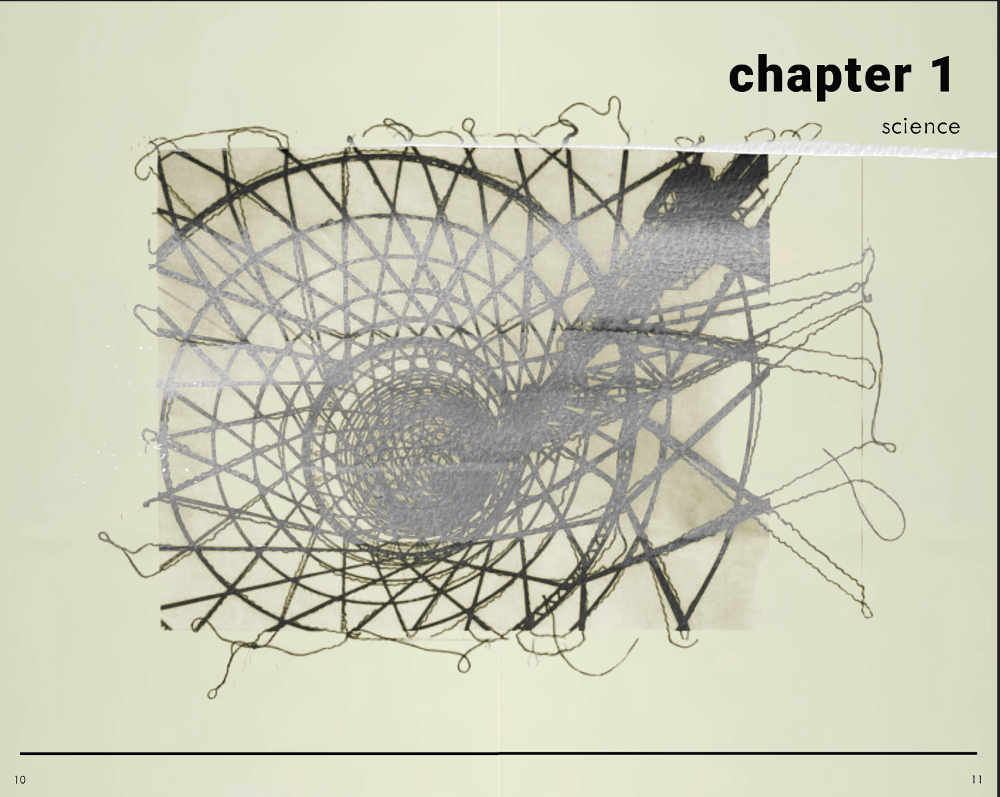
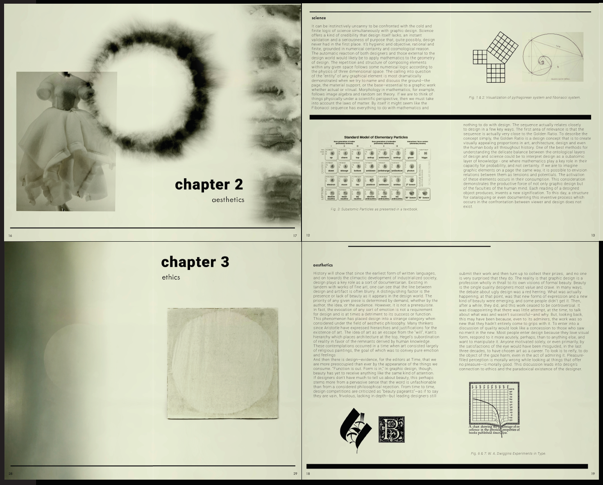
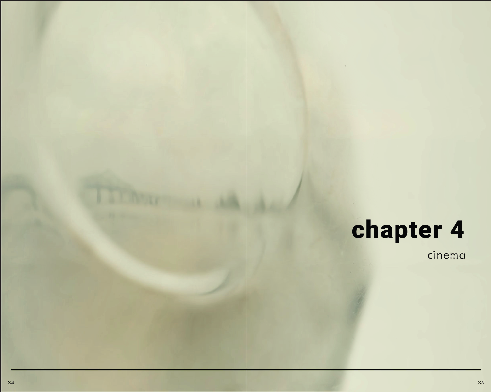
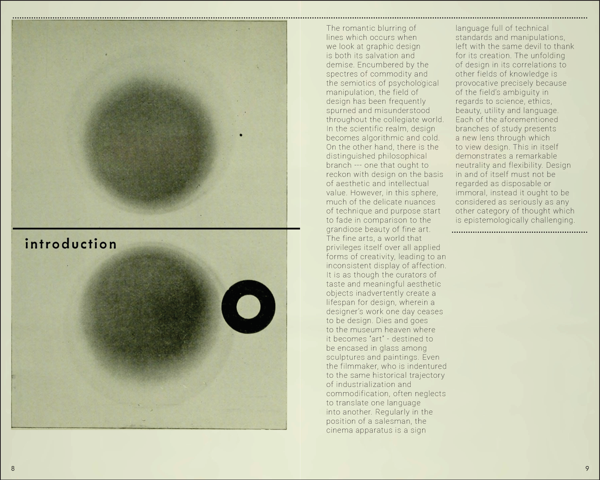
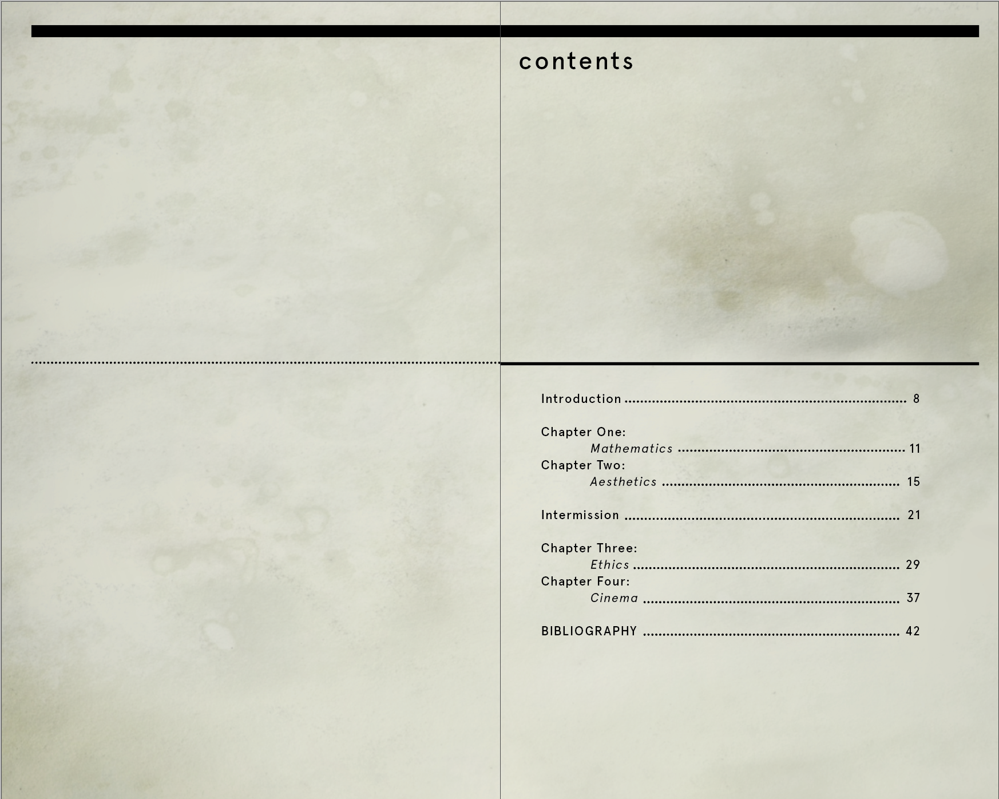

# Liaisons

This is a book I created as part of my junior thesis. It contains a thorough aesthetic exploration of time, as well as an inquiry into the accuracy of various methods of time representation. All of the designs and photographs in the book are my own, and they are accompanied by an essay which I wrote to support the overarching argument of the project.

## Gallery

