# Monotony

”Monotony” was a project in which I attempted to create a page-turning visual essay on the various vestiges of the monotonous experience. As a precursor to my essay film “Digital Monotony”, I chose to focus my attention of the cognitive appearance of monotony as it presented itself before the digital age. It came to my attention that the past, and much of its documentation, contains holes where there were moments of idleness and waiting (moments which have since become filled by the existence of the private bottomless screen).

## Gallery

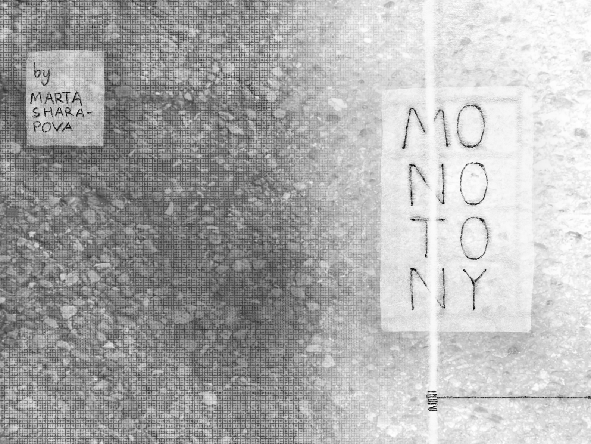

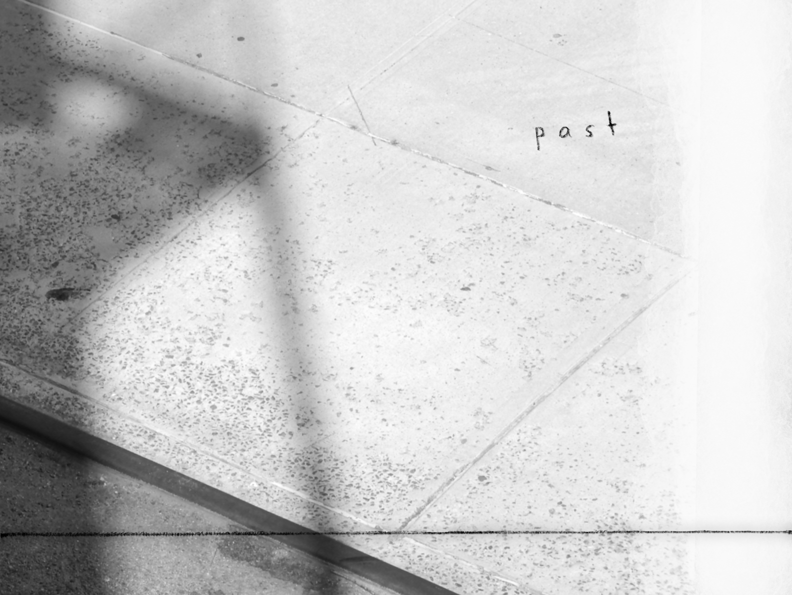

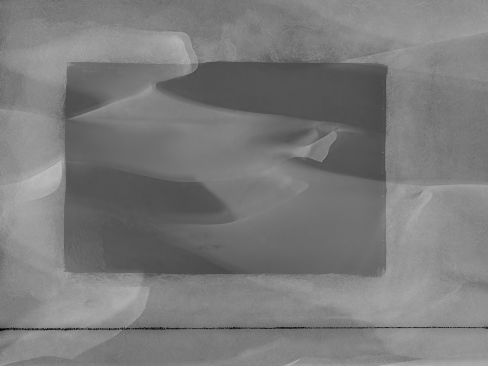

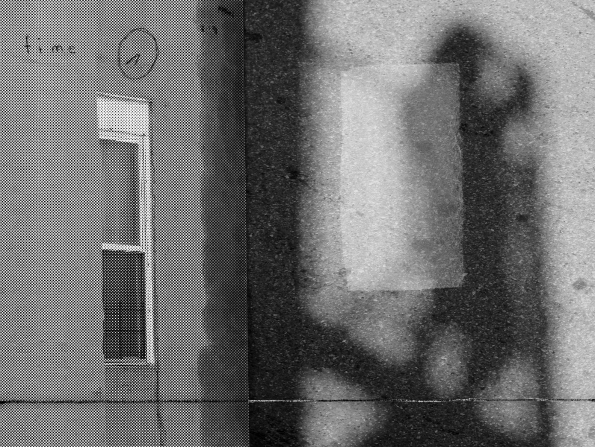

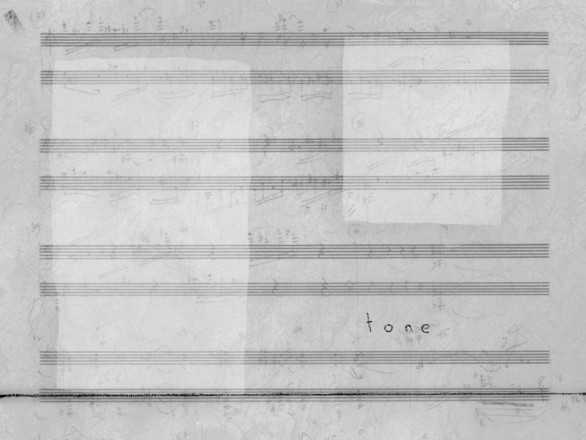

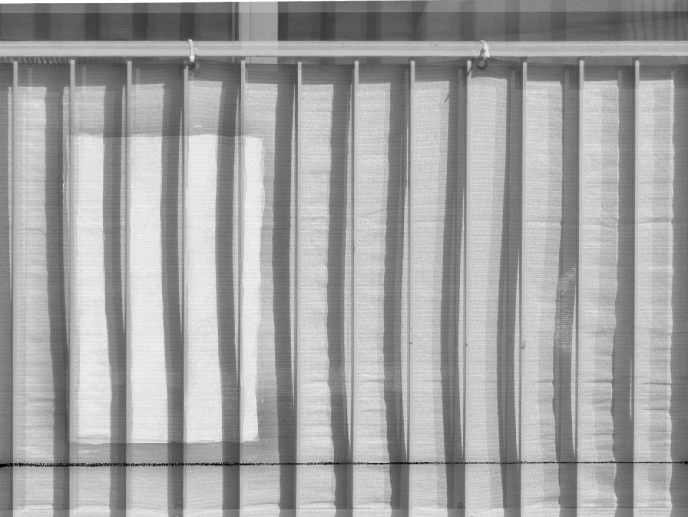

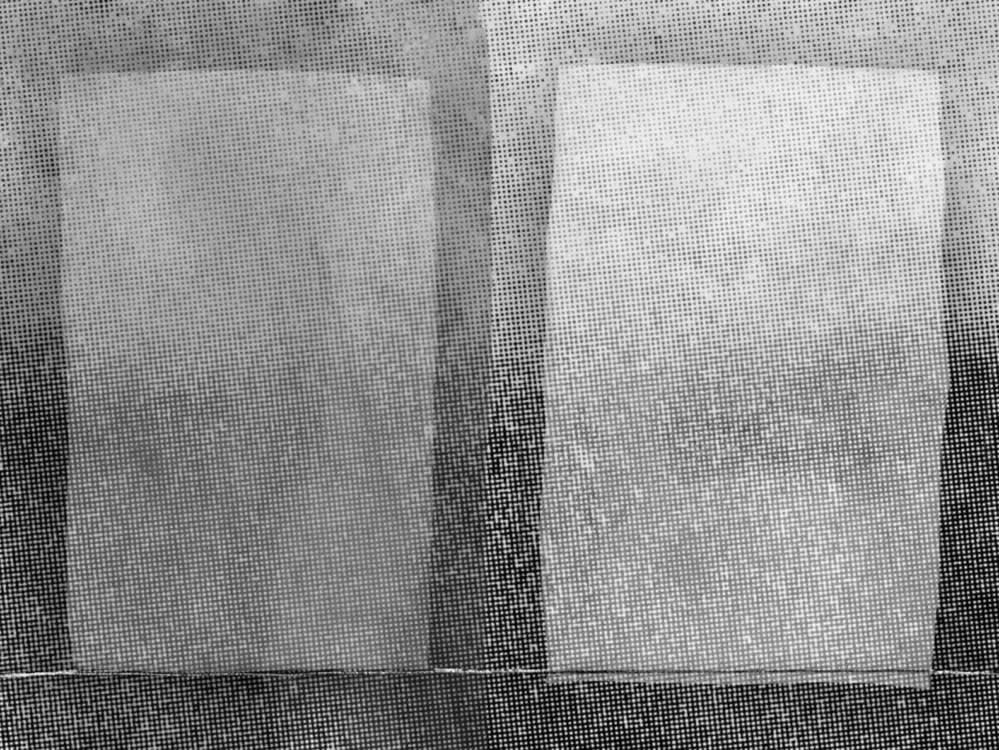

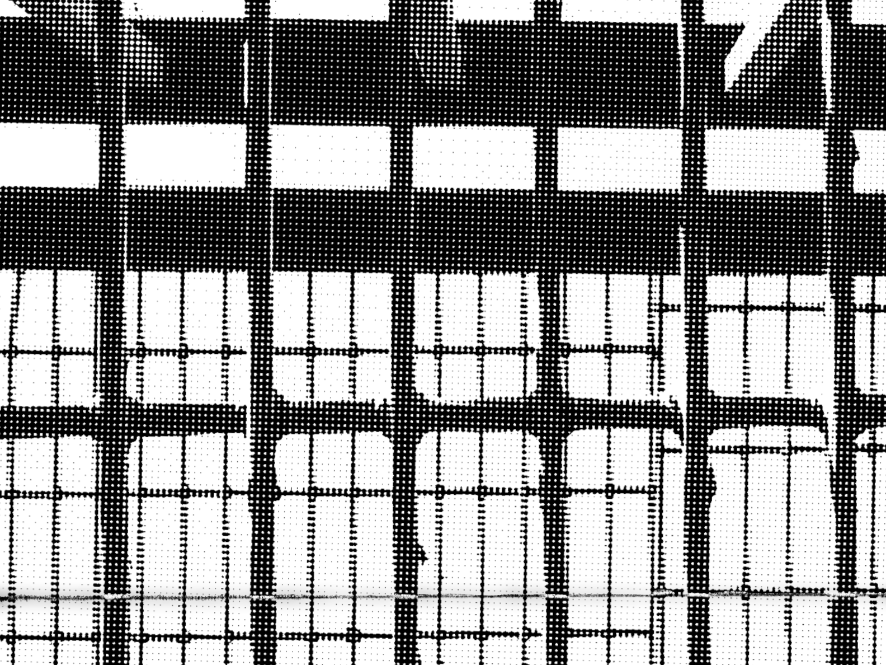

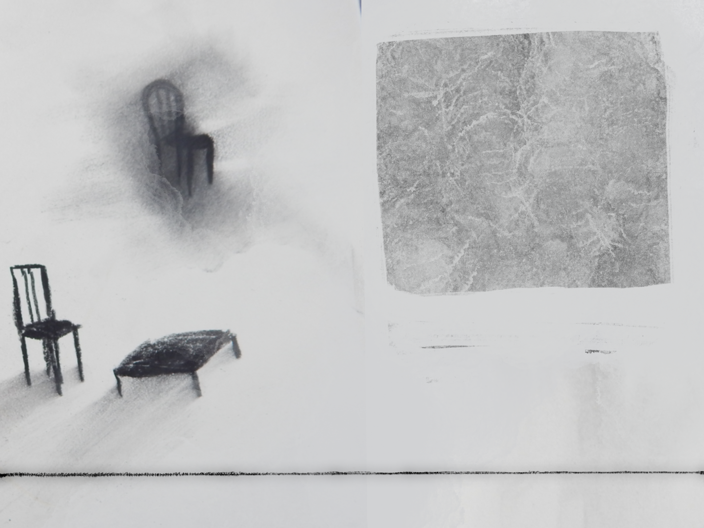

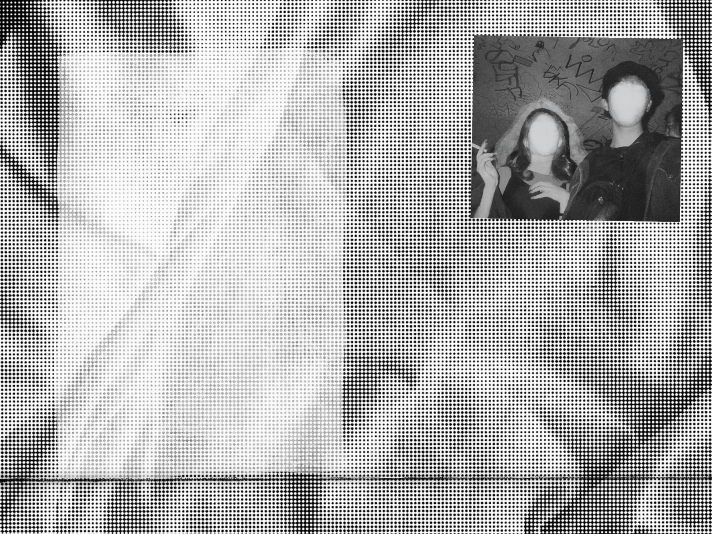

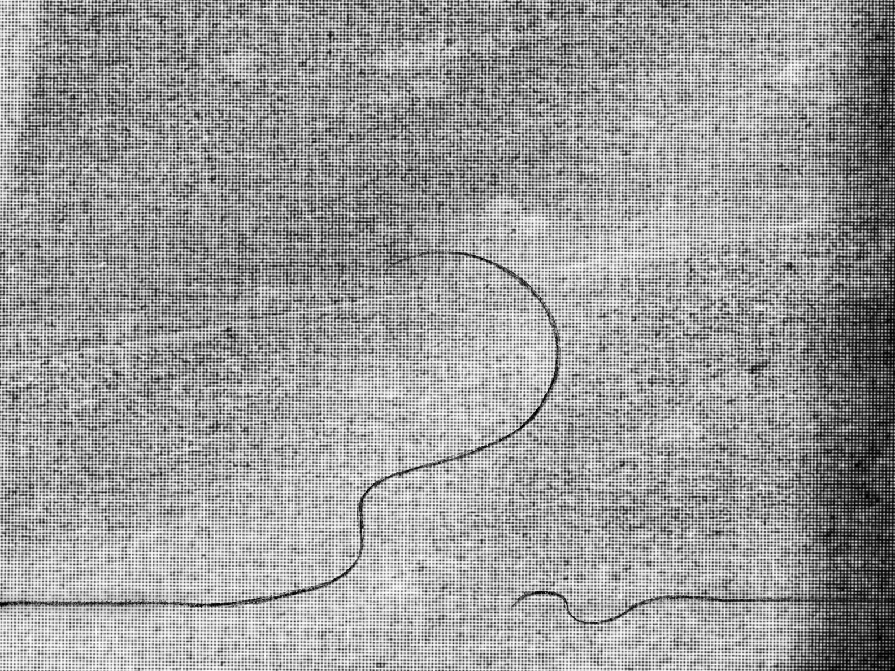

