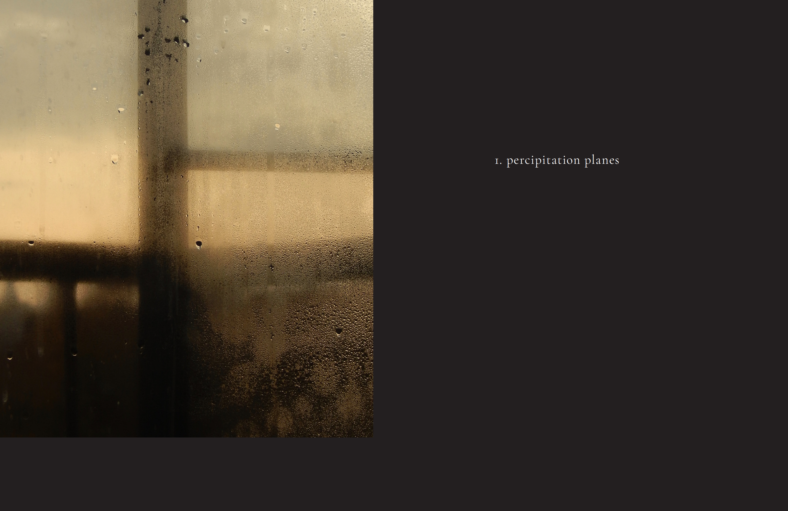
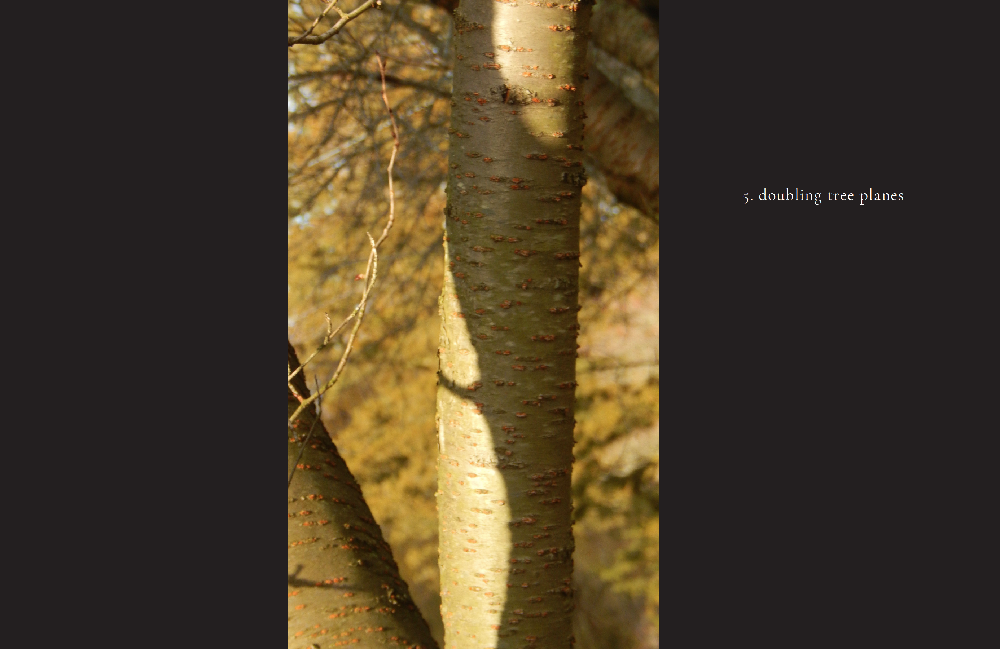
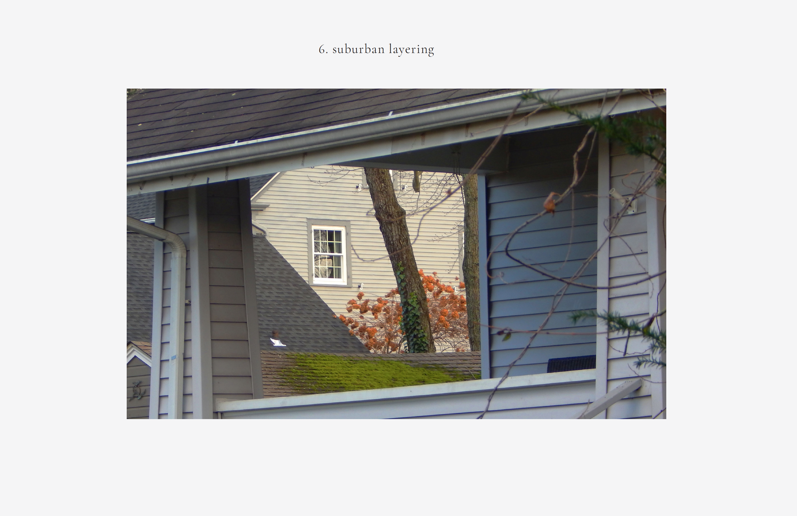
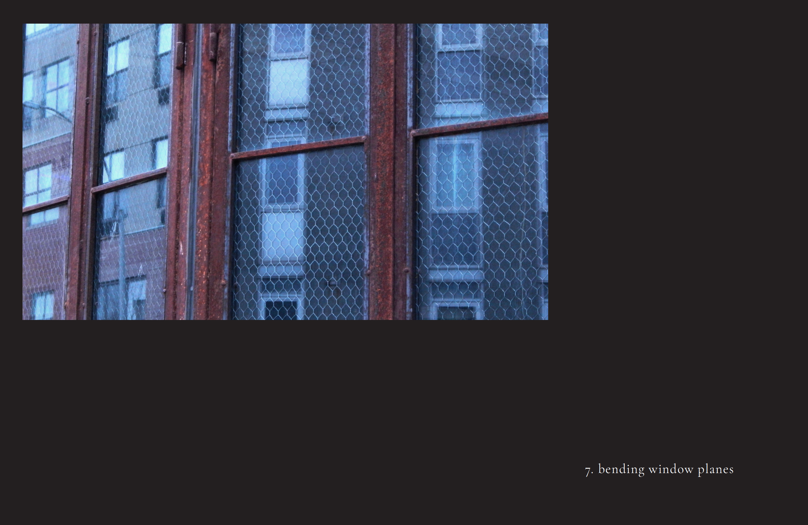
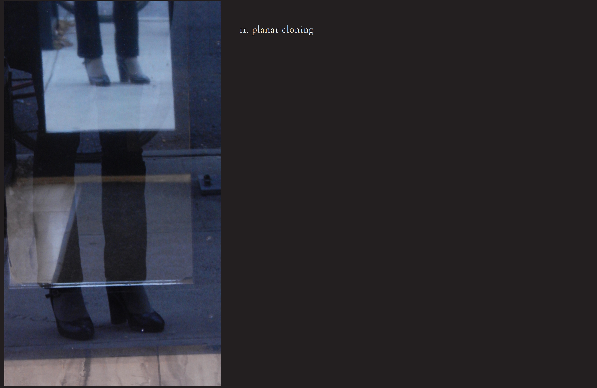
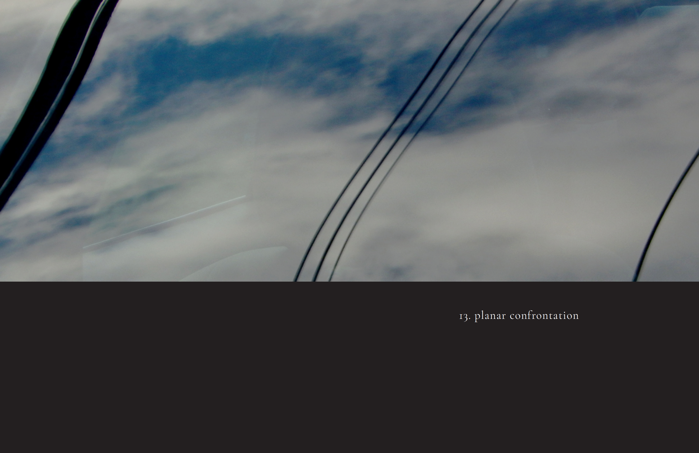
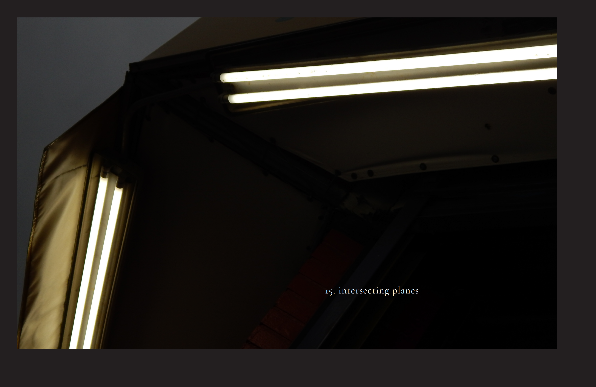

# Planar Uncertainty

Planar Uncertainty is a photography design project intended to treat the planes of reality and composition as one would the layers of a page upon which a design is created.

## Gallery

