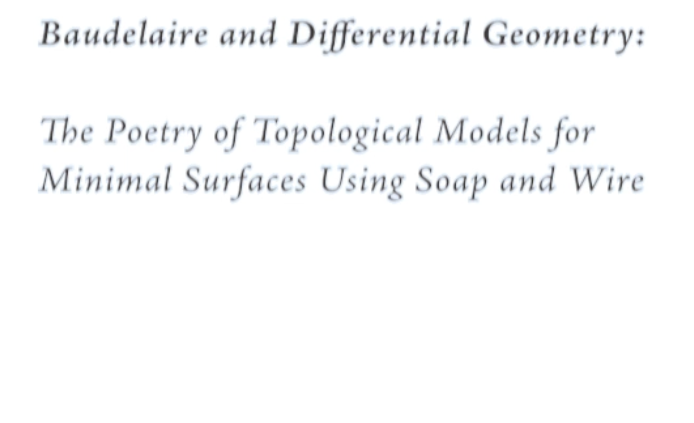
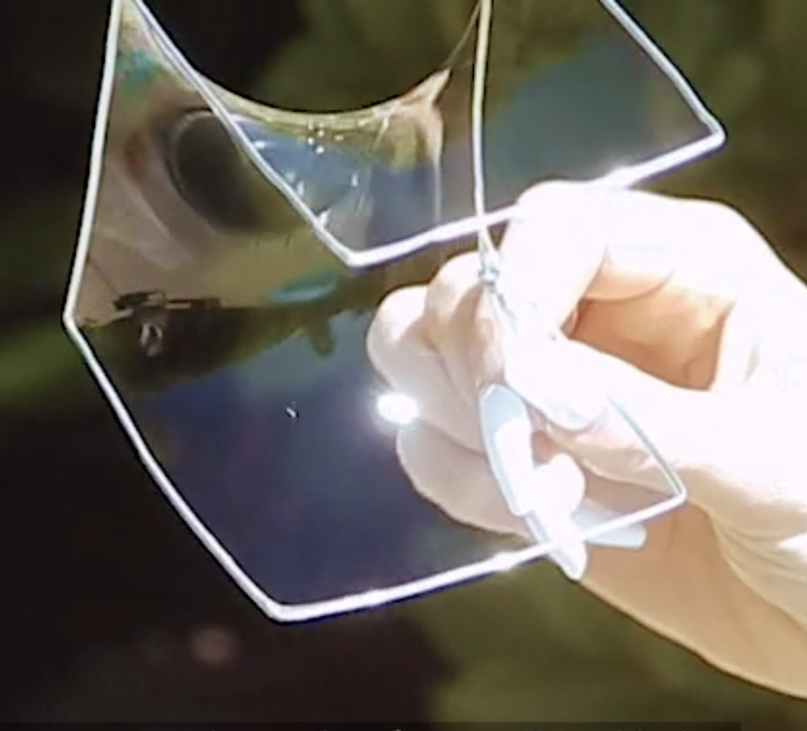
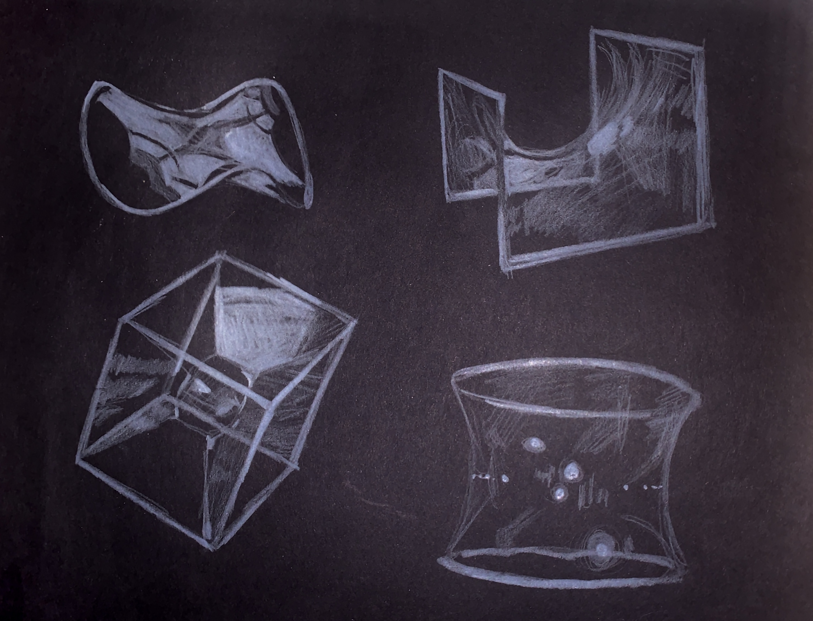
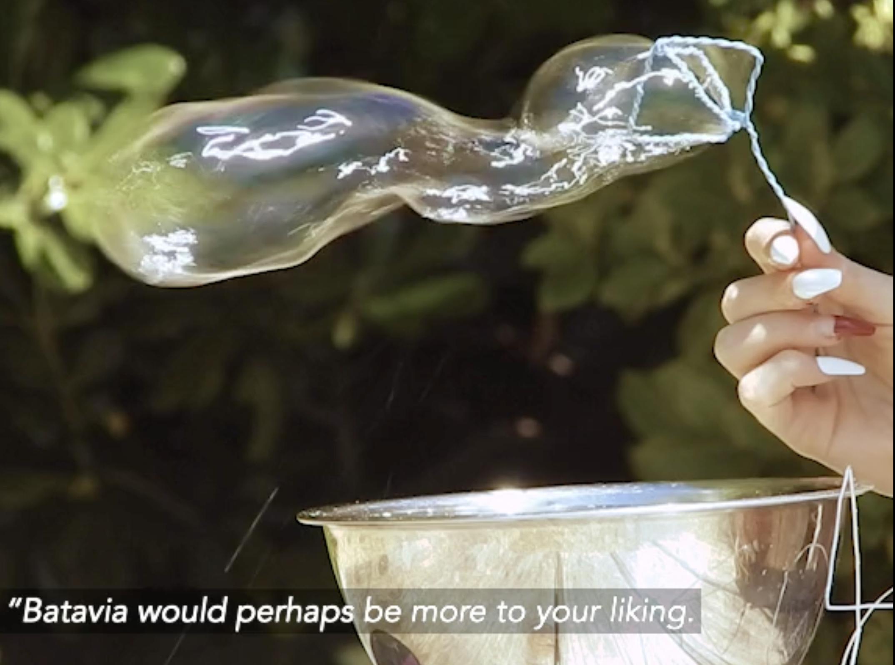

# Baudelaire's Differential Geometry

This baroque film was created in an effort to meditate on the poetics of Reimann’s manifolds. Their minimal surfaces are imperfect, but the swirling soap bubbles bulging in the wind attach a sort of soul to the mathematical experiment.

[Watch Here](https://vimeo.com/manage/videos/415742167)

## Gallery

