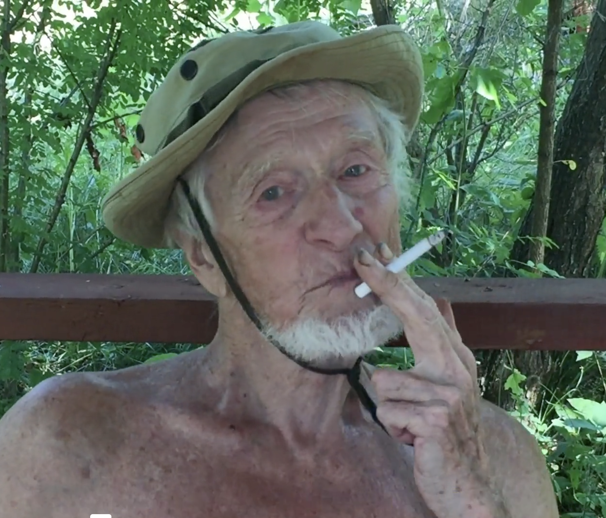

# Don Quixote

This short documentary about the Russian village “Zhary” where I spent each of my childhood summers was, unbeknownst to me, going to be my first and last opportunity to capture the essence of that setting. It now exists as a document of a memory I desperately cling to, and a beautiful portrait of my dearly beloved grandfather, whom, due to the treacherous war enacted by a fascistic dictator, I was unable to say farewell to before he passed.

[Watch Here](https://vimeo.com/283558929?share=copy&fl=sv&fe=ci)

## Gallery

