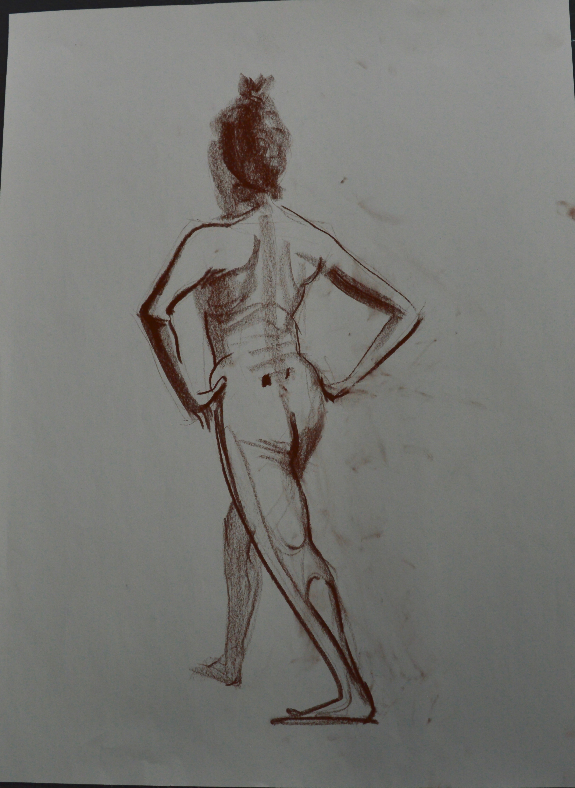
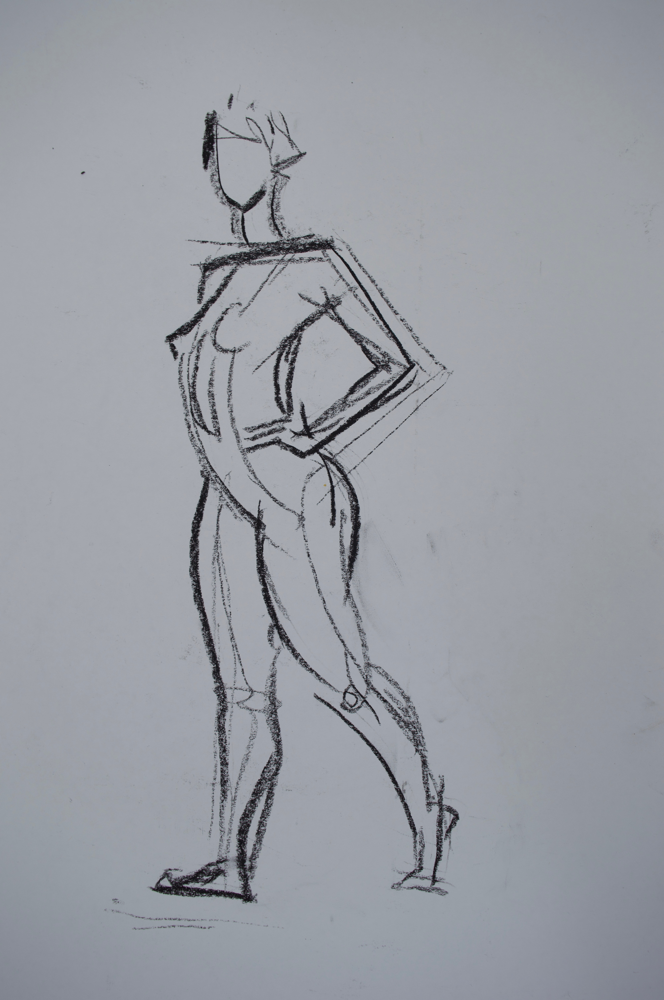
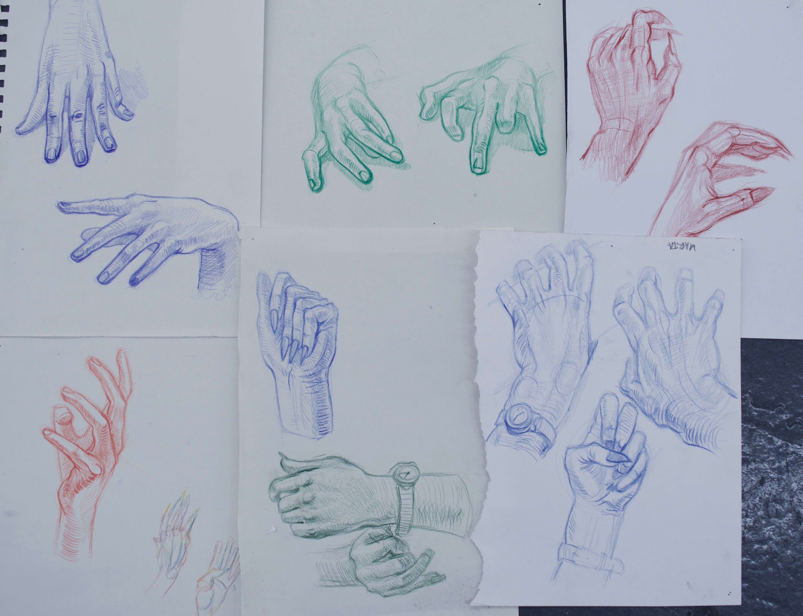
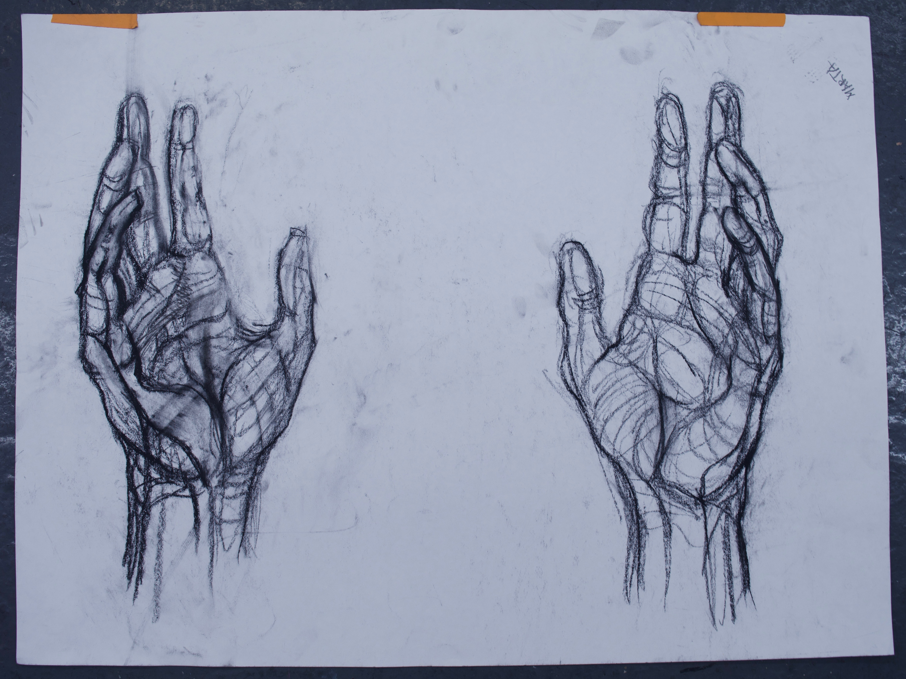
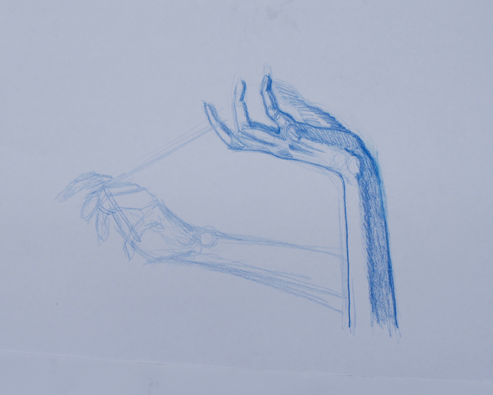
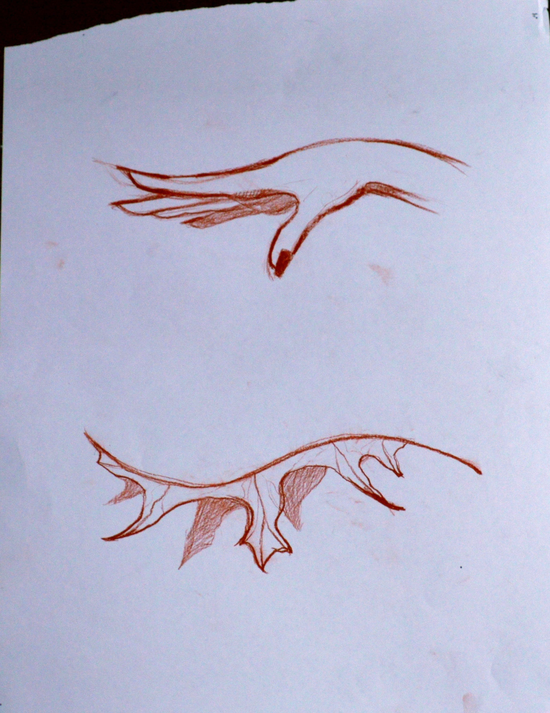
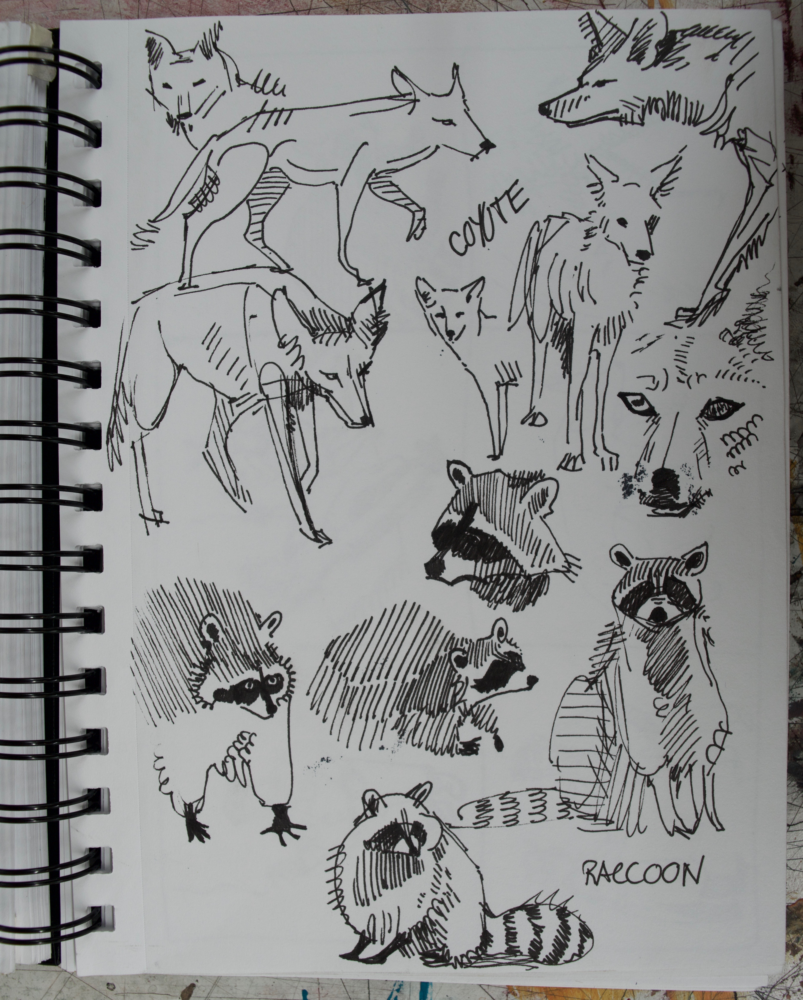
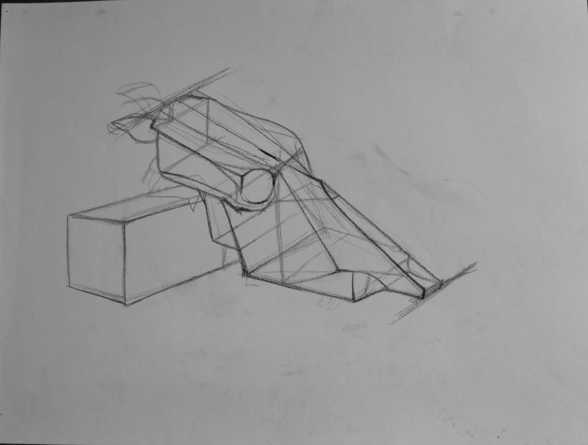
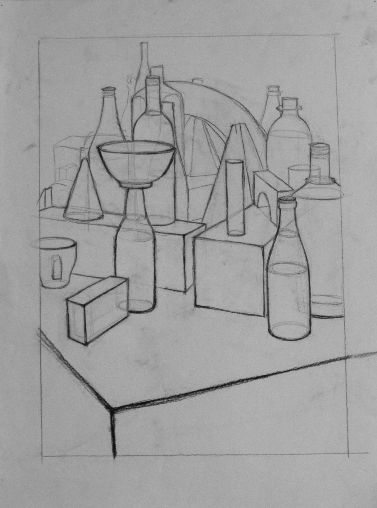

# Academic Drawings

## Gallery

*Description*
*Date*

*Description*
*Date*

*Description*
*Date*

*Description*
*Date*

*Description*
*Date*

*Description*
*Date*

*Description*
*Date*

*Description*
*Date*

*Description*
*Date*

*Description*
*Date*

*Description*
*Date*

*Description*
*Date*

*Description*
*Date*

*Description*
*Date*

*Description*
*Date*

*Description*
*Date*

*Description*
*Date*

*Description*
*Date*

*Description*
*Date*

