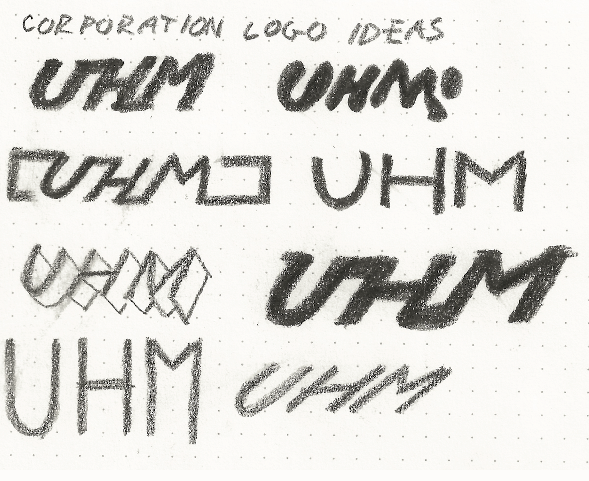
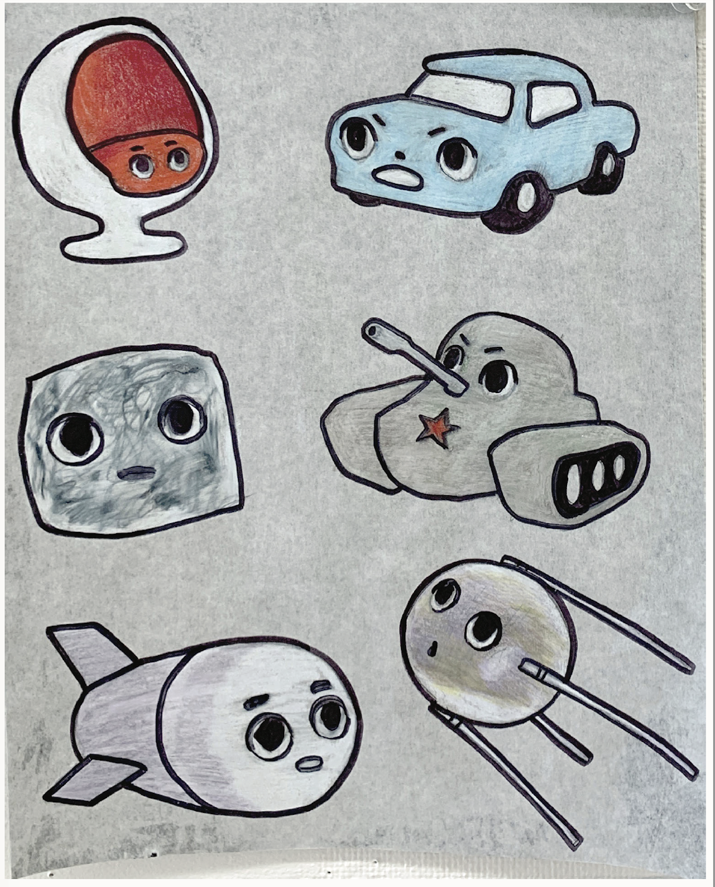
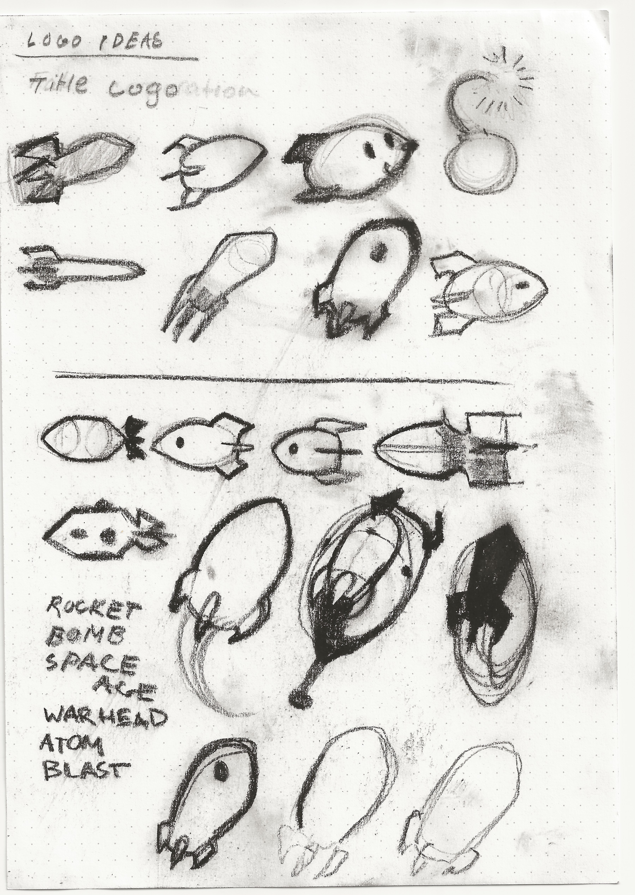

# Cold War

The act of gambling has no clear distinction of right and wrong, but playing with currency implies a market, and economic structure. Gambling can be regarded as a microcosm of economic activity. This project is an experiment of how it can be possible to make an economic ideology “cute”. Cuteness is a phenomenological experience of disorientation. With this product, the product itself is a mystery. The “Cold War” theme is a reference to the most clear historical confrontation of two opposing economic ideologies, and the gamble occurs in that winning and losing is defined by the participants own beliefs.

## Gallery

*Description*
*Date*

*Description*
*Date*

*Description*
*Date*

*Description*
*Date*

*Description*
*Date*

*Description*
*Date*

*Description*
*Date*

*Description*
*Date*

*Description*
*Date*

*Description*
*Date*

*Description*
*Date*

*Description*
*Date*

