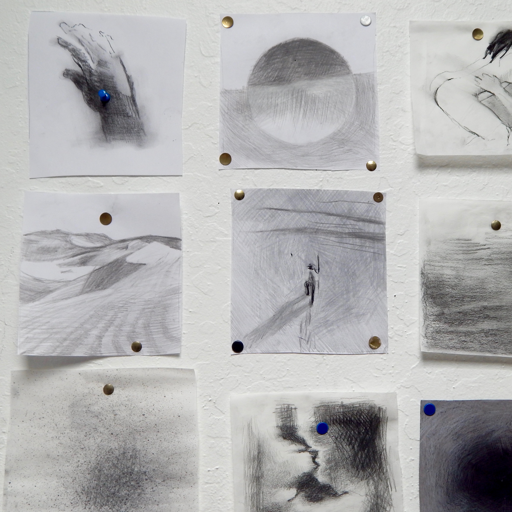
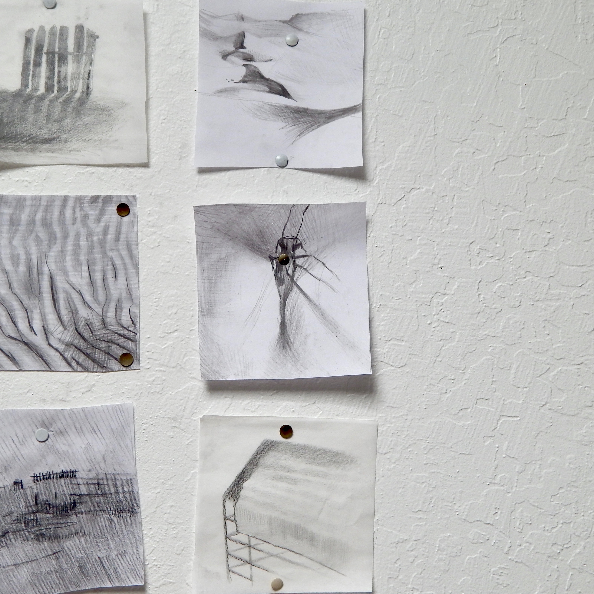
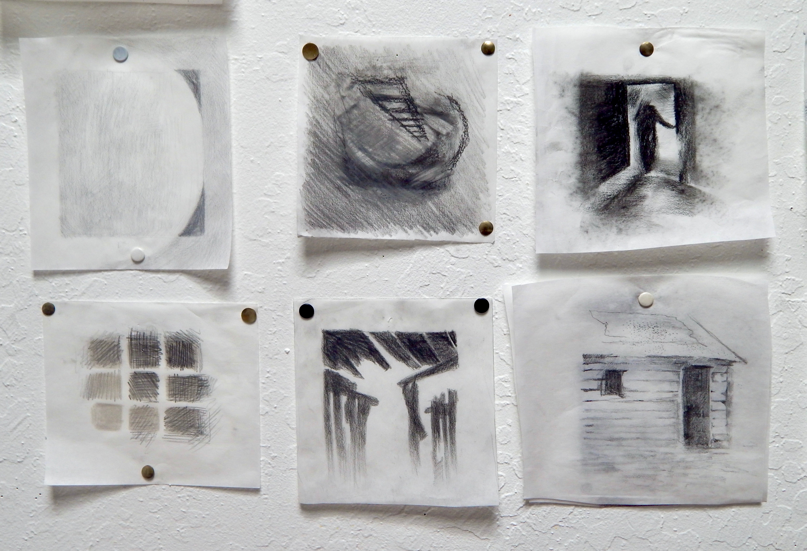
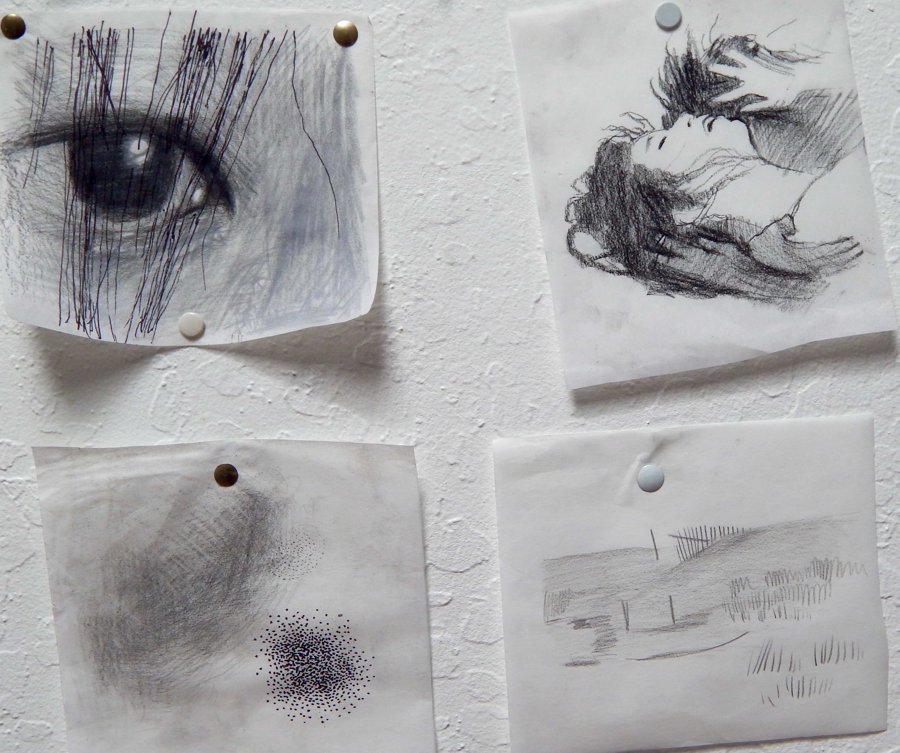
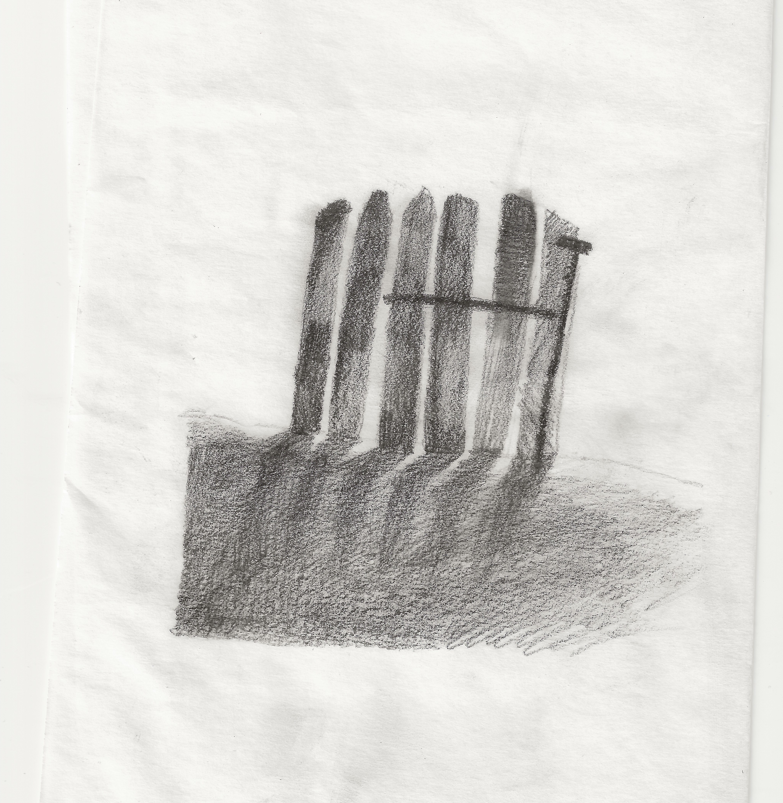

# Teshigahara

Hiroshi Teshigahara’s film “Woman in the Dunes” captures the feeling of suffocation, perversion and desperation in a way that no other film does. The fact that this film is in black and white inspired me to create a monotone mosaic, a study of the way sand and emotion are used to create a sinking feeling. The aim of this work was to derive the raw visual language of the film through thoughtful illustration and an intuitive expression the ineffable qualities of Teshigahara’s work.

## Gallery

